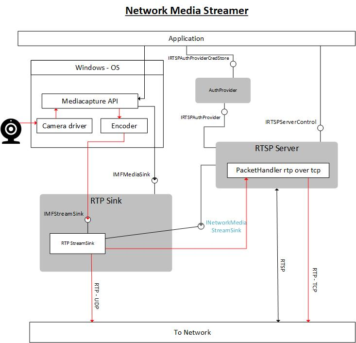

# NetworkMediaStreamer v1.0
## Introduction
The NetworkMediaStreamer is a set of basic implementations of RTP streaming and RTSP server to demonstrate usage of [Windows Media Foundation APIs](https://docs.microsoft.com/en-us/windows/win32/medfound/media-foundation-programming-guide) related to:
 1. Using and configuring OS built-in codecs
 2. Consuming samples/frames from the MediaFoundation stack of APIs
 
 The implementation also demonstrates:
 1. Using Windows APIs for network to implement RTP video (H.264/AVC) streaming and RTSP server , and using [Schannel APIs](https://docs.microsoft.com/en-us/windows/win32/com/schannel) for secure RTSP.
 2. Using credential store using [PasswordVault APIs](https://docs.microsoft.com/en-us/uwp/api/windows.security.credentials.passwordvault?view=winrt-19041) 

 This base implementation supports H264 RTP via RTSP . The code can be extended very easily to support more RTP payloads and other protocols as well. Refer to this figure to understand the interaction between various components.

  
 In the above figure, the red arrows denote Media data flow and the black arrows denote command and control flow.
 
 ## RTPSink
 The RTP streaming is implemented as a COM class which implements [IMFMediaSink](https://docs.microsoft.com/en-us/windows/win32/api/mfidl/nn-mfidl-imfmediasink). This class encapsulates the Network media stream sink which does the actual packetization work and UDP streaming. The NetworkMediaStream sink can be controlled via two interfaces:
 1. [IMFStreamSink](https://docs.microsoft.com/en-us/windows/win32/api/mfidl/nn-mfidl-imfstreamsink)
    - negotiating/setting media types and streaming states
    - supplying encoded samples to the sink.
 2. [INetworkMediaStreamSink](###INetworkMediaStreamSink)
    - adding network destination end points for streaming
    - adding custom packet transport handlers

The RTPSink instance can be created using the factory method

---
```
 HRESULT CreateRTPMediaSink( 
    IMFMediaType** apMediaTypes,
    DWORD          dwMediaTypeCount, 
    IMFMediaSink** ppMediaSink)
``` 
### Arguments  
|  |  |
| ----------- | ----------- |
| apMediaTypes | Input array of MFMediaType objects which describe each stream of the sink |
| dwMediaTypeCount | Input number of Media types in the array (number of streams to be created) |
| ppMediaSink | Output pointer to the instance of the RTP MediaSink |
---
### Return
>HRESULT 
: S_OK if succeeded. HRESULT error if failed. 
---

### Feeding samples/video to the RTPSink
This can be acheived using one of the following (but not limited to) options
1. Use [MFCreateSinkWriterFromMediaSink](https://docs.microsoft.com/en-us/windows/win32/api/mfreadwrite/nf-mfreadwrite-mfcreatesinkwriterfrommediasink) and write samples using the obtained [IMFSinkWriter](https://docs.microsoft.com/en-us/windows/win32/api/mfreadwrite/nn-mfreadwrite-imfsinkwriter) interface
2. Using a [Media Session](https://docs.microsoft.com/en-us/windows/win32/medfound/media-session)
3. Streaming Video from Camera using [Mediacapture](https://docs.microsoft.com/en-us/uwp/api/Windows.Media.Capture.MediaCapture?view=winrt-19041) and [Record to custom Sink](https://docs.microsoft.com/en-us/uwp/api/windows.media.capture.mediacapture.preparelowlagrecordtocustomsinkasync?view=winrt-19041)

## RTSP Server
The RTSP server control implements RTSP protocol to negotiate and setup RTP streaming to the clients from the RTPSink instances it holds. 
The RTSP Server controls the network side interface (INetworkMediaStreamSink) for all the sinks that it controls.
An instance of RTSP Server can be created by using the factory method: 

---
```
 HRESULT CreateRTSPServer(
    ABI::RTSPSuffixSinkMap *pStreamers,
    uint16_t socketPort,
    bool bSecure,
    IRTSPAuthProvider* pAuthProvider,
    PCCERT_CONTEXT* aServerCerts,
    size_t uCertCount,
    IRTSPServerControl** ppRTSPServerControl);

``` 
### Arguments  
|  |  |
| ----------- | ----------- |
| pStreamers | Input map of MediaSink objects as IMediaExtension interface and the corresponding url suffix. |
| socketPort | Input socket port on which the Server wil listen for RTSP requests. |
| bSecure | Input bool flag indicating if the server uses secure tcp connection |  
| pAuthProvider | Input pointer to the IRTSPAuthProvider interface to the authentication provider to be used by the server |
| aServerCerts | Input array of server certificate contexts to use for secure tcp tls. |
| uCertCount | Input number of certificate contexts in the array |
| ppRTSPServerControl | Output pointer to the [IRTSPServerControl](###IRTSPServerControl) interface to the RTSP server instance |
---
### Return  
>HRESULT 
: S_OK if succeeded. HRESULT error if failed. 
---

## Authentication provider

The authentication provider implements the following interfaces 
1. IRTSPAuthProvider: This interface is used by the RTSP server to authenticate incoming client connections
2. IRTSPAuthProviderCredStore: This interface is used by the administrative module of the app to add and remove credentials etc.  
A base/sample implementation of AuthProvider is included in the source. An instance to the authentication provider can be created using -
---
```
 HRESULT GetAuthProviderInstance(
    AuthType authType,
    LPCWSTR pResourceName,
    IRTSPAuthProvider** ppRTSPAuthProvider);
``` 
### Arguments  
|  |  |
| ----------- | ----------- |
| authType | Input array of MFMediaType objects which describe each stream of the sink |
| pResourceName | Input resource name to which the credentials are bound |
| ppRTSPAuthProvider | Output pointer to the IRTSPAuthProvider interface to the auth provider instance |
---
### Return  
>HRESULT 
: S_OK if succeeded. HRESULT error if failed. 
---

## Interface definitions
---
### IRTSPAuthProvider
```
IRTSPAuthProvider : public ::IUnknown
{
    virtual STDMETHODIMP GetNewAuthSessionMessage(HSTRING* pAuthSessionMessage) = 0;
    virtual STDMETHODIMP Authorize(LPCWSTR pAuthResp, LPCWSTR pAuthSesMsg, LPCWSTR pMethod) = 0;
};
```
`IRTSPAuthProvider::GetNewAuthSessionMessage(HSTRING* pAuthSessionMessage)`  
Generates nonce and Gets new authentication request message from Auth provider

| |  |  |
| ----------- | ----------- | --------- |
| pAuthSessionMessage | Output pointer to the Authentication request/description message to be sent to client as per [RFC7616](https://tools.ietf.org/html/rfc7616#section-3.7). | e.g. `WWW-Authenticate: Digest realm="BeyondTheWall", nonce="6fc93a0604338c68070b75e49745baeab46c507155040000", algorithm=MD5, charset="UTF-8", stale=FALSE` |
| return value | S_OK if succeeded. HRESULT error if failed. | 
| 

`IRTSPAuthProvider::Authorize(LPCWSTR pAuthResp, LPCWSTR pAuthSesMsg, LPCWSTR pMethod)`  
Verifies authorization response received from the client  
||||
| ----------- | ----------- | -------- |
| pAuthResp | Input pointer to Authorization response received from client| e.g. `Authorization: Digest username="user", realm="BeyondTheWall", nonce="8e03237a99bc26d6914a562fc98b08593fec11a055040000", uri="rtsp://127.0.0.1:8554", response="742dd5a18cddb799a861461ae72570b2"`|
| pAuthSesMsg | Input pointer to the authentication request that was sent to client | e.g. `WWW-Authenticate: Digest realm="BeyondTheWall", nonce="6fc93a0604338c68070b75e49745baeab46c507155040000", algorithm=MD5, charset="UTF-8", stale=FALSE` |
| pMethod | Input pointer to the name of the request method to be authenticated | e.g. `PLAY`| 
| return value | S_OK if succeeded. HRESULT error if failed. | `HRESULT_FROM_WIN32(ERROR_INVALID_PASSWORD)  if authentication fails.`


### IRTSPAuthProviderCredStore
```
IRTSPAuthProviderCredStore : public ::IUnknown
{
    virtual STDMETHODIMP AddUser(LPCWSTR pUserName, LPCWSTR pPassword) = 0;
    virtual STDMETHODIMP RemoveUser(LPCWSTR pUserName) = 0;
};
```
`IRTSPAuthProviderCredStore::AddUser(LPCWSTR pUserName, LPCWSTR pPassword)`  
Adds a new user to the credential store.
||||
| ----------- | ----------- | ----------- |
| pUserName | Input pointer to the Username to be added to the cred store
| pPassword | Input pointer to the password for the corresponding username

`IRTSPAuthProviderCredStore::RemoveUser(LPCWSTR pUserName)`  
Removes a user from credential store
||||
| ----------- | ----------- | ----------- |
| pUserName | Input pointer to the Username to be removed from the cred store
---
### IRTSPServerControl 
```
IRTSPServerControl : public ::IUnknown
{
public:
    virtual STDMETHODIMP StartServer() = 0;
    virtual STDMETHODIMP StopServer() = 0;
    virtual STDMETHODIMP AddLogHandler(
        LoggerType type,
        ABI::LogHandler* pHandler,
        EventRegistrationToken* pToken) = 0;
    virtual STDMETHODIMP RemoveLogHandler(
        LoggerType type,
        EventRegistrationToken token) = 0;
    virtual STDMETHODIMP AddSessionStatusHandler(
        LoggerType type, 
        ABI::SessionStatusHandler* handler,
        EventRegistrationToken* pToken) = 0;
    virtual STDMETHODIMP RemoveSessionStatusHandler(
        LoggerType type,
        EventRegistrationToken token) = 0;
};
```
`IRTSPServerControl::StartServer()`  
Starts the server by listening for incoming connections

`IRTSPServerControl::StopServer()`  
 Stops listening to incoming connections and terminates existing connections/sessions

`IRTSPServerControl::AddLogHandler(LoggerType type, ABI::LogHandler* pHandler, EventRegistrationToken* pToken)`  
Adds a handler delegate to capture logs from the server
| | | |
| ----------- | ----------- | -------- |
| type | Enum LoggerType specifying which category of logs to be handled by the delegate | `LoggerType::ERRORS , LoggerType::WARNINGS,   LoggerType::RTSPMSGS, LoggerType::OTHER`|
| pHandler | TypedEventHandler delegate taking HRESULT and HSTRING arguments | `auto handler = winrt::LogHandler([](HRESULT hr, HSTRING msg){ /* handle the logging*/});` `pHandler = handler.as<ABI::LogHandler>().get()` |
| pToken | token representing the delegate registration| See `RemoveLogHandler` |


`IRTSPServerControl::RemoveLogHandler(LoggerType type, EventRegistrationToken token)`  
Removes the handler delegate that was added to capture logs from the server
| | | |
| ----------- | ----------- | -------- |
| type | Enum LoggerType specifying which category of logs to be handled by the delegate | `LoggerType::ERRORS, LoggerType::WARNINGS, LoggerType::RTSPMSGS, LoggerType::OTHER` |
| pToken | token representing the delegate registration| Obtained by calling  `AddLogHandler` |
---
### INetworkMediaStreamSink
```
INetworkMediaStreamSink : public IMFStreamSink
{
public:
    virtual STDMETHODIMP AddTransportHandler (
        ABI::PacketHandler* packethandler,
        LPCWSTR protocol = L"rtp",
        LPCWSTR param = L"") = 0;
    virtual STDMETHODIMP RemoveTransportHandler(
        ABI::PacketHandler* packetHandler) = 0;
    virtual STDMETHODIMP AddNetworkClient(
        LPCWSTR destination,
        LPCWSTR protocol = L"rtp",
        LPCWSTR params = L"") = 0;
    virtual STDMETHODIMP RemoveNetworkClient(LPCWSTR destination) = 0;
    virtual STDMETHODIMP GenerateSDP(
        uint8_t* buf,
        size_t maxSize,
        LPCWSTR destination) = 0;
    virtual STDMETHODIMP Start(
        MFTIME hnsSystemTime,
        LONGLONG llClockStartOffset) = 0;
    virtual STDMETHODIMP Stop(MFTIME hnsSystemTime) = 0;
    virtual STDMETHODIMP Pause(MFTIME hnsSystemTime) = 0;
    virtual STDMETHODIMP Shutdown() = 0;
};
```  
`INetworkMediaStreamSink::AddNetworkClient(
        LPCWSTR pDestination,
        LPCWSTR pProtocol = L"rtp",
        LPCWSTR pParams = L"")`  
Adds a UDP client destination to stream RTP packets and starts streaming to the specified destination
| | | |
| ----------- | ----------- | -------- |
| pDestination | Input pointer to a string containing destination ip address and port with a ':' separator. | e.g. `L"192.168.10.22:6554"` |
| pProtocol | Input pointer to string specifying the packetization format/protocol prefix | at present the default and only supported format is `L"rtp"`|
| pParams | Input pointer to string containing extra parameters required to configure the client specific parameters in the format:  *param_name1=param_value1&param_name2=param_value2* | At present the only supported parameters are `ssrc` and `localrtpport`. e.g.-`L"ssrc=323454&localrtpport=5445"`. The default value for pParams is empty; an empty string  sets ssrc=0 and localrtpport is auto selected to an unused port.|


`INetworkMediaStreamSink::RemoveNetworkClient(LPCWSTR pDestination)`  
Stops streaming to the specified destination and removes the client destination.
| | | |
| ----------- | ----------- | -------- |
| pDestination | Input pointer to a string containing destination ip address and port with a ':' separator. | e.g. `L"192.168.10.22:6554"` |


`INetworkMediaStreamSink::AddTransportHandler (
        ABI::PacketHandler* pPackethandler,
        LPCWSTR protocol = L"rtp",
        LPCWSTR param = L"")`  
Adds a custom packet transport handler delegate and starts calling the delegate everytime a packet is ready to be sent. This is used by RTSP server to handle RTP media packet delivery over TCP connections.
| | | |
| ----------- | ----------- | -------- |
| pPackethandler | Input pointer to ABI interface of EventHandler delegate that takes IBuffer pointer as an argument.| e.g. `auto handler = winrt::PacketHandler([](IInspectable sender, IBuffer args){ /*handle the rtp packet- send it over tcp etc.*/});` `pPacketHandler = handler.as<ABI::PacketHandler>().get()`|
| pProtocol | Input pointer to string specifying the packetization format/protocol prefix | at present the default and only supported format is `L"rtp"`|
| pParams | Input pointer to string containing extra parameters required to configure the client specific parameters in the format:  *param_name1=param_value1&param_name2=param_value2* | At present the only supported parameters are `ssrc` and `localrtpport`. e.g.-`L"ssrc=323454&localrtpport=5445"`. The default value for pParams is empty; an empty string  sets ssrc=0 and localrtpport is auto selected to an unused port.|


`INetworkMediaStreamSink::RemoveTransportHandler(
        ABI::PacketHandler* pPacketHandler)`
Remove the specified custom transport handler delegate and stops calling the specified delegate for future packets.
| | | |
| ----------- | ----------- | -------- |
| pPackethandler | Input pointer to ABI interface of EventHandler delegate to be removed.| see: `INetworkMediaStreamSink::AddTransportHandler`|


`INetworkMediaStreamSink::GenerateSDP(
        uint8_t* pBuf,
        size_t maxSize,
        LPCWSTR pDestination)`  
Generated a Session Description Protocol buffer as per [RFC4566](https://tools.ietf.org/html/rfc4566)
| | | |
| ----------- | ----------- | -------- |
| pBuf | Input pointer to the start of an allocated buffer to receive the SDP payload ||
| maxSize | Input allocated size of the buffer pointed by pBuf| |
| pDestination | Input pointer to a string containing destination ip address and port with a ':' separator. | e.g. `L"192.168.10.22:6554"` |


`INetworkMediaStreamSink::Start(
        MFTIME hnsSystemTime,
        LONGLONG llClockStartOffset)`    
This is used by the Sink to manage streaming clock states. Refer to [IMFClockStateSink::OnClockStart](https://docs.microsoft.com/en-us/windows/win32/api/mfidl/nf-mfidl-imfclockstatesink-onclockstart)

`INetworkMediaStreamSink::Stop(MFTIME hnsSystemTime)`  
This is used by the Sink to manage streaming clock states. Refer to [IMFClockStateSink::OnClockStop](https://docs.microsoft.com/en-us/windows/win32/api/mfidl/nf-mfidl-imfclockstatesink-onclockstop)

`INetworkMediaStreamSink::Pause(MFTIME hnsSystemTime)`  
This is used by the Sink to manage streaming clock states. Refer to [IMFClockStateSink::OnClockPause](https://docs.microsoft.com/en-us/windows/win32/api/mfidl/nf-mfidl-imfclockstatesink-onclockpause)

`INetworkMediaStreamSink::Shutdown()`  
This is used by the Sink to convey media sink state to the stream sink. Refer to [IMFMediaSink::Shutdown](https://docs.microsoft.com/en-us/windows/win32/api/mfidl/nf-mfidl-imfmediasink-shutdown)

---
