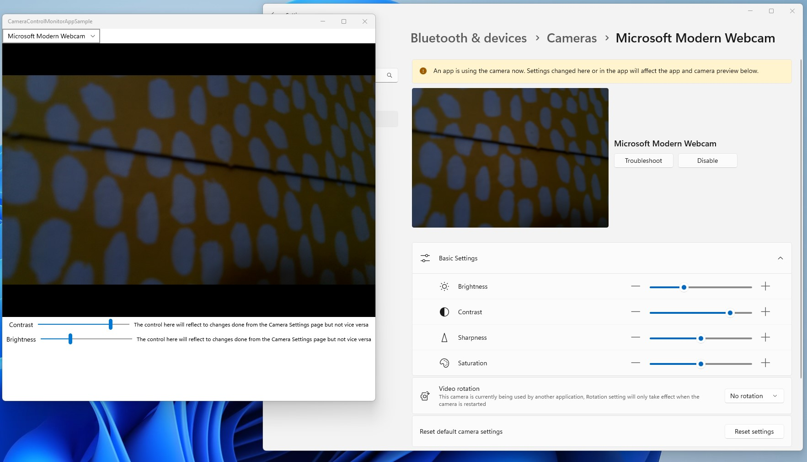

# ControlMonitorApp Sample

This sample app will demonstrate how to build an app that will be monitoring [camera controls](https://docs.microsoft.com/windows-hardware/drivers/stream/camera-control-properties) with [IMFCameraControlMonitor](https://docs.microsoft.com/windows/win32/api/mfidl/nn-mfidl-imfcameracontrolmonitor) APIs.

## Requirements
This sample is built using Visual Studio 2022 and requires [Windows SDK version 22621](https://developer.microsoft.com/en-us/windows/downloads/windows-sdk/).

## Sample functionality
The sample will enumerate available cameras and initialize and start the preview for one of them, user can change the used camera from the combo box.
The app will then create control listeners for brightness and contrast controls (assuming these are supported by the selected camera) and will update its slider values if an external application changes these values for the same camera.

The Camera Settings page can be used as the external application to demonstrate the control change events in the sample app. I.e., when the contrast slider is changed from the Camera Settings page, the sample application will reflect this change.
**NOTE:** Moving the sliders in the sample app **will not** be reflected in the Camera Settings sliders as those sliders are reflecting default values that are loaded unless an application overrides the values in its session.

