# Windows Studio Effects *(WSE)* driver – Windows DDIs and Exclusive DDIs, *WSE* device properties

- [Windows Standardized DDIs implemented by *WSE* (blur, eye contact, automatic framing)](#windows-standardized-ddis-implemented-by-wse)
- [Custom DDIs implemented by *WSE* for apps (creative filters, portrait light, automatic framing kind, supported control list, face metadata)](#wse-custom-ddi-specification)
- [Custom DDIs implemented by *WSE* for drivers (set notification, sensor crop, viewport updates)](#wse-custom-ddis-and-driver-properties-intended-for-driver-implementers-oems-and-ihvs)
- [Custom *WSE* device properties for drivers (high resolution modes, lens distortion correction, pinhole intrinsics, lens distortion model, face detection for 3A)](#wse-device-properties)

# Driver-Defined Interfaces (DDIs)
The *WSE* driver can be interacted with using APIs which transact according to a specified Driver-Defined Interface *(DDI)* using a [KSPROPERTY](https://learn.microsoft.com/en-us/windows-hardware/drivers/stream/ksproperty-structure) call that 
1. dictates either a GET or a SET operation as defined in a [KSCAMERA_EXTENDEDPROP_HEADER](https://learn.microsoft.com/en-us/windows-hardware/drivers/ddi/ksmedia/ns-ksmedia-tagkscamera_extendedprop_header)
2. followed by a related data payload (*PropertyData*) which can be either a common (and often unused) [KSCAMERA_EXTENDEDPROP_VALUE](https://learn.microsoft.com/en-us/windows-hardware/drivers/ddi/ksmedia/ns-ksmedia-tagkscamera_extendedprop_value) or a custom payload format. 

The below specification details the allowed operations for each DDIs and the expected payload format.

## Windows standardized DDIs implemented by *WSE*
Some of the Windows Studio Effects are actionable using standardized Windows DDIs included in the Windows SDK under 
the [extended camera controls](https://learn.microsoft.com/en-us/windows-hardware/drivers/stream/kspropertysetid-extendedcameracontrol) property set:
- **Standard Blur, Portrait Blur and Segmentation Mask Metadata**: KSPROPERTY_CAMERACONTROL_EXTENDED_BACKGROUNDSEGMENTATION (*[DDI documentation](https://learn.microsoft.com/en-us/windows-hardware/drivers/stream/ksproperty-cameracontrol-extended-backgroundsegmentation)*)
- **Eye Contact Standard and Teleprompter**: KSPROPERTY_CAMERACONTROL_EXTENDED_EYEGAZECORRECTION (*[DDI documentation](https://learn.microsoft.com/en-us/windows-hardware/drivers/stream/ksproperty-cameracontrol-extended-eyegazecorrection)*)
- **Automatic Framing**: KSPROPERTY_CAMERACONTROL_EXTENDED_DIGITALWINDOW (*[DDI documentation](https://learn.microsoft.com/en-us/windows-hardware/drivers/stream/ksproperty-cameracontrol-extended-digitalwindow)*) and KSPROPERTY_CAMERACONTROL_EXTENDED_DIGITALWINDOW_CONFIGCAPS (*[DDI documentation](https://learn.microsoft.com/en-us/windows-hardware/drivers/stream/ksproperty-cameracontrol-extended-digitalwindow-configcaps)*)

From an application standpoint, these Windows standardized DDIs can be programmatically interacted with either using:
- *WinRT*, refer to the example on the [previous page here](<./README.md#code-walkthrough>) and in the code sample included in this repo folder

- *Win32* level via the *[IMFExtendedCameraController](https://learn.microsoft.com/en-us/windows/win32/api/mfidl/nn-mfidl-imfextendedcameracontroller)* retrieved from an *IMFMediaSource* followed by 
an instance of the *[IMFExtendedCameraControl](https://learn.microsoft.com/en-us/windows/win32/api/mfidl/nn-mfidl-imfextendedcameracontrol)* for each control. Here's an example for sending a GET and a SET payload for the **[Eye Contact Standard](https://learn.microsoft.com/en-us/windows-hardware/drivers/stream/ksproperty-cameracontrol-extended-eyegazecorrection)** DDI.
    #### C++ example to leverage Windows standardized DDI implemented by *WSE*
    ~~~cpp
    #include <ks.h>
    #include <ksmedia.h>

    // Assuming you initialize your camera source "spMediaSource" in your code using IMFCaptureEngine
    wil::com_ptr_nothrow<IMFMediaSource> spMediaSource;

        //... in your method ...

        // Retrieve the IMFExtendedCameraController
        wil::com_ptr_nothrow<IMFExtendedCameraController> spExtendedCameraController;
        wil::com_ptr_nothrow<IMFGetService> spGetService;
        wil::com_ptr_nothrow<IMFExtendedCameraControl> spExtendedCameraControl;

        RETURN_IF_FAILED(spMediaSource->QueryInterface(IID_PPV_ARGS(&spGetService)));
        RETURN_IF_FAILED(spGetService->GetService(GUID_NULL, IID_PPV_ARGS(&spExtendedCameraController)));

        // If the GET call succeeds
        if (SUCCEEDED(spExtendedCameraController->GetExtendedCameraControl(MF_CAPTURE_ENGINE_MEDIASOURCE,
            KSPROPERTY_CAMERACONTROL_EXTENDED_EYEGAZECORRECTION,
            &spExtendedCameraControl)))
        {
            // Check if Eye gaze correction DDI is supported and it is not already ON
            if (KSCAMERA_EXTENDEDPROP_EYEGAZECORRECTION_ON & spExtendedCameraControl->GetCapabilities()
                && (KSCAMERA_EXTENDEDPROP_EYEGAZECORRECTION_OFF == spExtendedCameraControl->GetFlags()))
            {
                // Tell the camera to turn it on.
                RETURN_IF_FAILED(spExtendedCameraControl->SetFlags(KSCAMERA_EXTENDEDPROP_EYEGAZECORRECTION_ON));
                // Write the changed settings to the driver.
                RETURN_IF_FAILED(spExtendedCameraControl->CommitSettings());
            }
        }
    ~~~

## Custom DDIs implemented by *WSE* driver
A newer set of effects supported in *WSE* version 2 and 3 are exposed as custom DDIs under a different and exclusive property set (***KSPROPERTYSETID_WindowsStudioCameraControl*** defined below) not standardized with a particular Windows SDK:

 - **Portrait Light: [KSPROPERTY_CAMERACONTROL_WINDOWSSTUDIO_STAGELIGHT](#KSPROPERTY_CAMERACONTROL_WINDOWSSTUDIO_STAGELIGHT-Control)** (version 2+)
 - **Creative Filters: [KSPROPERTY_CAMERACONTROL_WINDOWSSTUDIO_CREATIVEFILTER](#KSPROPERTY_CAMERACONTROL_WINDOWSSTUDIO_CREATIVEFILTER-Control)** (version 2+)
 - **Automatic Framing kind: [KSPROPERTY_CAMERACONTROL_WINDOWSSTUDIO_AUTOMATICFRAMINGKIND](#KSPROPERTY_CAMERACONTROL_WINDOWSSTUDIO_AUTOMATICFRAMINGKIND-Control)** (version 3+)

 Furthermore, the Windows Studio driver component exposes additional DDIs that can be useful to applications to: 
 - Report which *DDIs* are supported and implemented by *WSE* specifically (***version 1+***): **[KSPROPERTY_CAMERACONTROL_WINDOWSSTUDIO_SUPPORTED](#KSPROPERTY_CAMERACONTROL_WINDOWSSTUDIO_SUPPORTED-Control)** 
 - Disclose if any predefined mean to mitigate performance decrease can be exercised and is currently used when polled (***version 2+***): **[KSPROPERTY_CAMERACONTROL_WINDOWSSTUDIO_PERFORMANCEMITIGATION](#KSPROPERTY_CAMERACONTROL_WINDOWSSTUDIO_PERFORMANCEMITIGATION-Control)** 
 - Exercise and retrieve useful face tracking metadata (***version 3+***): **[KSPROPERTY_CAMERACONTROL_WINDOWSSTUDIO_FACEMETADATA](#KSPROPERTY_CAMERACONTROL_WINDOWSSTUDIO_FACEMETADATA-Control)**, [MF_WINDOWSSTUDIO_METADATA_FACETRACKING](#MF_WINDOWSSTUDIO_METADATA_FACETRACKING), [MF_WINDOWSSTUDIO_METADATA_FACELANDMARKS](#MF_WINDOWSSTUDIO_METADATA_FACELANDMARKS), [MF_WINDOWSSTUDIO_METADATA_FACEPOSE](#MF_WINDOWSSTUDIO_METADATA_FACEPOSE) 

 Finally, the Windows Studio driver component exposes DDIs meant to interop only with other driver components such as DMFTs and AVStream driver (and not and application) so that:
 - they can register to be notified when certain effects are toggled in *WSE*: **[KSPROPERTY_CAMERACONTROL_WINDOWSSTUDIO_SETNOTIFICATION](#KSPROPERTY_CAMERACONTROL_WINDOWSSTUDIO_SETNOTIFICATION-Control)** (version 2+)
 - they can register to be notified when *WSE* leverages only a part of its input frame (such as when applying automatic framing or cropping) for processing its output frame: **[KSPROPERTY_CAMERACONTROL_WINDOWSSTUDIO_UPDATED_VIEWPORT](#KSPROPERTY_CAMERACONTROL_WINDOWSSTUDIO_UPDATED_VIEWPORT-Control)** (version 3+)
 - they can report when the region of the sensor leveraged is cropped in a certain custom way: **[KSPROPERTY_CAMERACONTROL_WINDOWSSTUDIO_SENSORCENTERCROP](#KSPROPERTY_CAMERACONTROL_WINDOWSSTUDIO_SENSORCENTERCROP-Control)** (version 3+)

#### C++ definition of *WSE* custom DDIs:
~~~cpp
// Property set exclusive to Windows Studio Effects under which custom DDIs are defined
// {C1D740A8-BC18-43F4-A500-6BDF91839FDE}
static GUID KSPROPERTYSETID_WindowsStudioCameraControl = { 0x1666d655, 0x21a6, 0x4982, 0x97, 0x28, 0x52, 0xc3, 0x9e, 0x86, 0x9f, 0x90 };

// Windows Studio Effects custom DDIs defined under the KSPROPERTYSETID_WindowsStudioCameraControl property set
typedef enum {
    KSPROPERTY_CAMERACONTROL_WINDOWSSTUDIO_SUPPORTED = 0,
    KSPROPERTY_CAMERACONTROL_WINDOWSSTUDIO_STAGELIGHT = 1,
    KSPROPERTY_CAMERACONTROL_WINDOWSSTUDIO_CREATIVEFILTER = 2,
    KSPROPERTY_CAMERACONTROL_WINDOWSSTUDIO_SETNOTIFICATION = 3,
    KSPROPERTY_CAMERACONTROL_WINDOWSSTUDIO_PERFORMANCEMITIGATION = 4,
    KSPROPERTY_CAMERACONTROL_WINDOWSSTUDIO_FACEMETADATA = 5,
    KSPROPERTY_CAMERACONTROL_WINDOWSSTUDIO_SENSORCENTERCROP = 6,
    KSPROPERTY_CAMERACONTROL_WINDOWSSTUDIO_AUTOMATICFRAMINGKIND = 7,
    KSPROPERTY_CAMERACONTROL_WINDOWSSTUDIO_UPDATED_VIEWPORT = 8
} KSPROPERTY_CAMERACONTROL_WINDOWSSTUDIO_PROPERTY;
~~~
In order to use these DDIs for *WSE* version 2 in your code, you would copy those definitions into your header file as they are not included in any of the Windows SDK.

From an application standpoint, these *WSE* custom DDIs can be programmatically interacted with either using:
- *WinRT*, refer to the example on the [previous page here](<./README.md#code-walkthrough>) and in the code sample included in this repo folder

- *Win32* level via the the *[IKSControl](https://learn.microsoft.com/en-us/windows-hardware/drivers/ddi/ksproxy/nn-ksproxy-ikscontrol)* interface retrieved from an *IMFMediaSource* followed by invoking the *[IKsControl::KsProperty()](https://learn.microsoft.com/en-us/windows-hardware/drivers/ddi/ksproxy/nf-ksproxy-ikscontrol-ksproperty)* method with the data payload below prescribed for each of the *WSE* custom DDI. Here's an example for sending a GET and a SET payload for the **[Creative Filters](#KSPROPERTY_CAMERACONTROL_WINDOWSSTUDIO_CREATIVEFILTER-Control)** custom DDI.
    #### C++ example to leverage custom *WSE* DDI
    ~~~cpp
    #include <ks.h>
    #include <ksmedia.h>

    // Assuming you initialize your camera source "spMediaSource" in your code using IMFCaptureEngine
    wil::com_ptr_nothrow<IMFMediaSource> spMediaSource;

        //... in your method ...

        // Retrieve the IKsControl interface
        wil::com_ptr_nothrow<IKsControl> spKsControl;
        if (SUCCEEDED(spMediaSource->QueryInterface(IID_PPV_ARGS(&spKsControl))))
        {
            // Create a GET data payload to send down to the *WSE* driver to query capability

            // First define the target DDI and operation (a GET) using a KSPROPERTY
            KSPROPERTY creativeFilterGetProperty =
            {
                KSPROPERTYSETID_WindowsCameraEffect, // set
                KSPROPERTY_CAMERACONTROL_WINDOWSSTUDIO_CREATIVEFILTER, // id
                KSPROPERTY_TYPE_GET // flag
            };

            // Create the data payload for a GET operation.
            // The data payload layout follows the specification and is comprised in this case of a KSCAMERA_EXTENDEDPROP_HEADER 
            // followed by a KSCAMERA_EXTENDEDPROP_VALUE
            ULONG getCreativeFilterPayloadSizeNeeded = sizeof(KSCAMERA_EXTENDEDPROP_HEADER) + sizeof(KSCAMERA_EXTENDEDPROP_VALUE);
            wil::unique_cotaskmem_ptr<BYTE[]> spGetCreativeFilterPayload = wil::make_unique_cotaskmem_nothrow<BYTE[]>(getCreativeFilterPayloadSizeNeeded);
            KSCAMERA_EXTENDEDPROP_HEADER* pExtendedHeader = (KSCAMERA_EXTENDEDPROP_HEADER*)spGetCreativeFilterPayload.get();
            KSCAMERA_EXTENDEDPROP_VALUE* pValue = (KSCAMERA_EXTENDEDPROP_VALUE*)(pExtendedHeader + 1);
            
            // Assign proper values to the payload
            *pExtendedHeader =
            {
                1, // Version
                KSCAMERA_EXTENDEDPROP_FILTERSCOPE, // PinID
                getCreativeFilterPayloadSizeNeeded, // Size
                0, // Result
                0, // Flags
                0 // Capability
            };
            pValue->Value.ull = 0;

            // Check if CreativeFilter DDI is supported in driver
            HRESULT hr = spKsControl->KsProperty(
                &creativeFilterGetProperty,
                sizeof(KSPROPERTY), 
                spGetCreativeFilterPayload.get(), 
                getCreativeFilterPayloadSizeNeeded, 
                &getCreativeFilterPayloadSizeNeeded);

            // if the DDI is supported and a particular Flags value value reported as supported in the Capability field, 
            // in this case KSCAMERA_WINDOWSSTUDIO_CREATIVEFILTER_ILLUSTRATED, 
            // let's now send a SET payload to set that particular Flags value
            if (SUCCEEDED(hr) && (KSCAMERA_WINDOWSSTUDIO_CREATIVEFILTER_ILLUSTRATED & pExtendedHeader->Capability))
            {
                // Define the target DDI and operation (a SET this time) using a KSPROPERTY
                KSPROPERTY creativeFilterSetProperty =
                {
                    KSPROPERTYSETID_WindowsCameraEffect, // set
                    KSPROPERTY_CAMERACONTROL_WINDOWSSTUDIO_CREATIVEFILTER, // id
                    KSPROPERTY_TYPE_SET// flag
                };

                // Create the data payload for a SET operation.
                // The data payload layout follows the specification and is comprised of a KSCAMERA_EXTENDEDPROP_HEADER 
                // followed by a KSCAMERA_EXTENDEDPROP_VALUE
                ULONG setCreativeFilterPayloadSizeNeeded = getCreativeFilterPayloadSizeNeeded;
                wil::unique_cotaskmem_ptr<BYTE[]> spSetCreativeFilterPayload = wil::make_unique_cotaskmem_nothrow<BYTE[]>(setCreativeFilterPayloadSizeNeeded);
                KSCAMERA_EXTENDEDPROP_HEADER* pExtendedHeader2 = (KSCAMERA_EXTENDEDPROP_HEADER*)spSetCreativeFilterPayload.get();
                KSCAMERA_EXTENDEDPROP_VALUE* pValue2 = (KSCAMERA_EXTENDEDPROP_VALUE*)(pExtendedHeader2 + 1);
                
                // Assign proper values to the payload
                *pExtendedHeader2 =
                {
                    1, // Version
                    KSCAMERA_EXTENDEDPROP_FILTERSCOPE, // PinID
                    getCreativeFilterPayloadSizeNeeded, // Size
                    0, // Result
                    KSCAMERA_WINDOWSSTUDIO_CREATIVEFILTER_ILLUSTRATED, // Flags
                    0 // Capability
                };
                pValue->Value.ull = 0;

                // Send a SET payload for the CreativeFilter DDI
                hr = spKsControl->KsProperty(
                    &creativeFilterSetProperty,
                    sizeof(KSPROPERTY),
                    spSetCreativeFilterPayload.get(),
                    setCreativeFilterPayloadSizeNeeded,
                    &setCreativeFilterPayloadSizeNeeded);

                if (SUCCEEDED(hr))
                {
                    // we have sucessfully sent our SET payload
                }
            }
        }
    ~~~

# *WSE* custom profile
*WSE* exposes a custom *"passthrough"* profile that exposes all MediaTypes but prevents usage of any effect DDIs. This profile can be leveraged by application to bypass [stream, resolution and framerate limits](<./README.md#WSE-limits-frame-formats-and-profiles>) imposed by *WSE* for scenarios such as recording at higher resolution when possible. This custom profile definition needs to be copied in your code as it is not a Windows standard profile defined in WDK.

#### C++ definition of custom "passthrough" profile exposed by *WSE*
~~~cpp
// A custom camera profile specific to Windows Studio Effects that allows through 
// all MediaTypes on color pin(s) but without effect DDIs support. Useful for
// example to record videos at resolution or framerate outside the ranges supported
// to apply effects.
// {E4ED96D9-CD40-412F-B20A-B7402A43DCD2}
static GUID KSCAMERAPROFILE_WindowsStudioNoEffectsColorPassthrough = { 0xe4ed96d9, 0xcd40, 0x412f, 0xb2, 0xa, 0xb7, 0x40, 0x2a, 0x43, 0xdc, 0xd2 };
~~~

# *WSE* custom DDI specification
The GET and SET data payload format for each of these custom *WSE* DDIs is covered below. 

## KSPROPERTY_CAMERACONTROL_WINDOWSSTUDIO_SUPPORTED Control
This control allows to retrieve a list of supported KSProperties intercepted and implemented specifically by the Windows Studio Effects (*WSE*) camera driver component. Think of it as exclusively a *getter* for which controls corresponding to KSPROPERTY_CAMERACONTROL_EXTENDED_\*, KSPROPERTY_CAMERACONTROL_WINDOWSSTUDIO_\* and any other custom property set that are implemented directly within *WSE* driver component. It can be preemptively queried before individually proceeding to getting capabilities for each of them if interaction with exclusively the *WSE* driver is desired or simply used to correlate with an existing set of DDI capabilities already fetched to understand if their implementation is provided by *WSE* or another component that is part of the camera driver stack.

### Usage Summary
| Scope | Control | Type | GET | SET |
| ----- | ----- | ----- | ----- | ----- |
| Version 1 | Filter | Synchronous| ✔️ | ❌ |

The SET call of this control will fail.

The KSPROPERTY payload follows the same layout as traditional KSPROPERTY_CAMERACONTROL_EXTENDED_PROPERTY, comprised of a [KSCAMERA_EXTENDEDPROP_HEADER](https://learn.microsoft.com/en-us/windows-hardware/drivers/ddi/ksmedia/ns-ksmedia-tagkscamera_extendedprop_header) followed by a content of size of *sizeof(KSPROPERTY) \** ***n***
where ***"n"*** is the count of [KSPROPERTY](https://learn.microsoft.com/en-us/windows-hardware/drivers/stream/ksproperty-structure) reported.
#### KSCAMERA_EXTENDEDPROP_HEADER
| **Member** | **Description** |
| ----- | ----- |
| **Version** | Must be 1 |
| **PinId** | This must be KSCAMERA_EXTENDEDPROP_FILTERSCOPE (0xFFFFFFFF).
| **Size** | sizeof(KSCAMERA_EXTENDEDPROP_HEADER) + n * sizeof(KSPROPERTY) where "n" is the count of KSPROPERTY reported |
| **Result** | Unused, must be 0
| **Capability** | Unused, must be 0
| **Flags** | Unused, must be 0

for example, a GET call could return the following payload to be reinterpreted: if *WSE* supports all the effects in version 1 and 2, containing a KSCAMERA_EXTENDEDPROP_HEADER struct followed by **8** KSPROPERTY struct :
| | | |
|----- | ----- | ----- |
|⬇️| [KSCAMERA_EXTENDEDPROP_HEADER](https://learn.microsoft.com/en-us/windows-hardware/drivers/ddi/ksmedia/ns-ksmedia-tagkscamera_extendedprop_header) | *Version* = 1,  *PinID* = KSCAMERA_EXTENDEDPROP_FILTERSCOPE  *Size* = **8** \* sizeof(KSPROPERTY)  *Result* = 0  *Capability* = 0  *Flags* = 0|
|⬇️| [KSPROPERTY](https://learn.microsoft.com/en-us/windows-hardware/drivers/stream/ksproperty-structure) | *Set* = KSPROPERTYSETID_ExtendedCameraControl  *Id* = KSPROPERTY_CAMERACONTROL_EXTENDED_BACKGROUNDSEGMENTATION  *Flags* = KSPROPERTY_TYPE_GET |
|⬇️| [KSPROPERTY](https://learn.microsoft.com/en-us/windows-hardware/drivers/stream/ksproperty-structure) | *Set* = KSPROPERTYSETID_ExtendedCameraControl  *Id* = KSPROPERTY_CAMERACONTROL_EXTENDED_EYEGAZECORRECTION  *Flags* = KSPROPERTY_TYPE_GET |
|⬇️| [KSPROPERTY](https://learn.microsoft.com/en-us/windows-hardware/drivers/stream/ksproperty-structure) | *Set* = KSPROPERTYSETID_ExtendedCameraControl  *Id* = KSPROPERTY_CAMERACONTROL_EXTENDED_DIGITALWINDOW  *Flags* = KSPROPERTY_TYPE_GET |
|⬇️| [KSPROPERTY](https://learn.microsoft.com/en-us/windows-hardware/drivers/stream/ksproperty-structure) | *Set* = KSPROPERTYSETID_ExtendedCameraControl  *Id* = KSPROPERTY_CAMERACONTROL_EXTENDED_DIGITALWINDOW_CONFIGCAPS  *Flags* = KSPROPERTY_TYPE_GET |
|⬇️| [KSPROPERTY](https://learn.microsoft.com/en-us/windows-hardware/drivers/stream/ksproperty-structure) | *Set* = KSPROPERTYSETID_ExtendedCameraControl  *Id* = KSPROPERTY_CAMERACONTROL_WINDOWSSTUDIO_STAGELIGHT  *Flags* = KSPROPERTY_TYPE_GET |
|⬇️| [KSPROPERTY](https://learn.microsoft.com/en-us/windows-hardware/drivers/stream/ksproperty-structure) | *Set* = KSPROPERTYSETID_ExtendedCameraControl  *Id* = KSPROPERTY_CAMERACONTROL_WINDOWSSTUDIO_CREATIVEFILTER  *Flags* = KSPROPERTY_TYPE_GET |
|⬇️| [KSPROPERTY](https://learn.microsoft.com/en-us/windows-hardware/drivers/stream/ksproperty-structure) | *Set* = KSPROPERTYSETID_ExtendedCameraControl  *Id* = KSPROPERTY_CAMERACONTROL_WINDOWSSTUDIO_SETNOTIFICATION  *Flags* = KSPROPERTY_TYPE_GET |
|🔚| [KSPROPERTY](https://learn.microsoft.com/en-us/windows-hardware/drivers/stream/ksproperty-structure) | *Set* = KSPROPERTYSETID_ExtendedCameraControl  *Id* = KSPROPERTY_CAMERACONTROL_WINDOWSSTUDIO_PERFORMANCEMITIGATION  *Flags* = KSPROPERTY_TYPE_GET |
----------

----------
## KSPROPERTY_CAMERACONTROL_WINDOWSSTUDIO_STAGELIGHT Control
The Stage Light DDI allows to turn ON or OFF the application of the Stage Light effect on the frames. This effect enhances the visual appearance of a face by identifying then processing face pixels with a suite of solutions such as augmenting resolution, removing noise and illumination artifacts, brightening, etc. 

### Usage Summary
| Scope | Control | Type | GET | SET |
| ----- | ----- | ----- | ----- | ----- |
| Version 1 | Filter | Synchronous| ✔️ | ✔️ |

The KSPROPERTY payload follows the same layout as traditional KSPROPERTY_CAMERACONTROL_EXTENDED_PROPERTY, comprised of a [KSCAMERA_EXTENDEDPROP_HEADER](https://learn.microsoft.com/en-us/windows-hardware/drivers/ddi/ksmedia/ns-ksmedia-tagkscamera_extendedprop_header) followed by a content of size of a [KSCAMERA_EXTENDEDPROP_VALUE](https://learn.microsoft.com/en-us/windows-hardware/drivers/ddi/ksmedia/ns-ksmedia-tagkscamera_extendedprop_value).

~~~cpp
// Stage Light possible flags values
#define KSCAMERA_WINDOWSSTUDIO_STAGELIGHT_OFF 0x0000000000000000
#define KSCAMERA_WINDOWSSTUDIO_STAGELIGHT_ON  0x0000000000000001
~~~

#### KSCAMERA_EXTENDEDPROP_HEADER
| **Member** | **Description** |
| ----- | ----- |
| **Version** | Must be 1 |
| **PinId** | This must be KSCAMERA_EXTENDEDPROP_FILTERSCOPE (0xFFFFFFFF). |
| **Size** | sizeof(KSCAMERA_EXTENDEDPROP_HEADER) + sizeof(KSCAMERA_EXTENDEDPROP_VALUE) |
| **Result** | Unused, must be 0 |
| **Capability** | Must at least contain a different valid potential flag value than KSCAMERA_WINDOWSSTUDIO_STAGELIGHT_OFF |
| **Flags** | KSCAMERA_WINDOWSSTUDIO_STAGELIGHT_OFF or KSCAMERA_WINDOWSSTUDIO_STAGELIGHT_ON |
----------

----------
## KSPROPERTY_CAMERACONTROL_WINDOWSSTUDIO_CREATIVEFILTER Control
The Creative Filter DDI allows to toggle a pre-defined effect that alters the appearance of a primary subject in the scene. The effect modifies the facial area and potentially also the background of the main subject.

### Usage Summary
| Scope | Control | Type | GET | SET |
| ----- | ----- | ----- | ----- | ----- |
| Version 1 | Filter | Synchronous| ✔️ | ✔️ |

The KSPROPERTY payload follows the same layout as traditional KSPROPERTY_CAMERACONTROL_EXTENDED_PROPERTY, comprised of a [KSCAMERA_EXTENDEDPROP_HEADER](https://learn.microsoft.com/en-us/windows-hardware/drivers/ddi/ksmedia/ns-ksmedia-tagkscamera_extendedprop_header) followed by a content of size of a [KSCAMERA_EXTENDEDPROP_VALUE](https://learn.microsoft.com/en-us/windows-hardware/drivers/ddi/ksmedia/ns-ksmedia-tagkscamera_extendedprop_value).

~~~cpp
// Creative Filter possible flags values
#define KSCAMERA_WINDOWSSTUDIO_CREATIVEFILTER_OFF         0x0000000000000000
#define KSCAMERA_WINDOWSSTUDIO_CREATIVEFILTER_ILLUSTRATED 0x0000000000000001
#define KSCAMERA_WINDOWSSTUDIO_CREATIVEFILTER_ANIMATED    0x0000000000000002
#define KSCAMERA_WINDOWSSTUDIO_CREATIVEFILTER_WATERCOLOR  0x0000000000000004
~~~

#### KSCAMERA_EXTENDEDPROP_HEADER
| **Member** | **Description** |
| ----- | ----- |
| **Version** | Must be 1 |
| **PinId** | This must be KSCAMERA_EXTENDEDPROP_FILTERSCOPE (0xFFFFFFFF). |
| **Size** | sizeof(KSCAMERA_EXTENDEDPROP_HEADER) + sizeof(KSCAMERA_EXTENDEDPROP_VALUE) |
| **Result** | Unused, must be 0 |
| **Capability** | Must at least contain a different valid potential flag value than KSCAMERA_WINDOWSSTUDIO_CREATIVEFILTER_OFF |
| **Flags** |KSCAMERA_WINDOWSSTUDIO_ CREATIVEFILTER_OFF or KSCAMERA_WINDOWSSTUDIO_CREATIVEFILTER_ILLUSTRATED or KSCAMERA_WINDOWSSTUDIO_CREATIVEFILTER_ANIMATED or KSCAMERA_WINDOWSSTUDIO_CREATIVEFILTER_WATERCOLOR |
----------

----------
## KSPROPERTY_CAMERACONTROL_WINDOWSSTUDIO_PERFORMANCEMITIGATION Control
This control act as a polling mechanism to identify if the current camera opted into *WSE* can be subject to means of performance mitigation when experiencing for example a dip in framerate due to compute resource contention causing frame processing to take longer than the frame timing deadline. In effect this can take the shape of degrading slightly the quality of an effect in an attempt to lighten the computational load. Having this control allows an app to preemptively advertise this cue to the user as well as query the current state of such mitigation.

### Usage Summary
| Scope | Control | Type | GET | SET |
| ----- | ----- | ----- | ----- | ----- |
| Version 1 | Filter | Synchronous| ✔️ | ❌ |

The SET call of this control will fail.

The KSPROPERTY payload follows the same layout as traditional KSPROPERTY_CAMERACONTROL_EXTENDED_PROPERTY, comprised of a [KSCAMERA_EXTENDEDPROP_HEADER](https://learn.microsoft.com/en-us/windows-hardware/drivers/ddi/ksmedia/ns-ksmedia-tagkscamera_extendedprop_header) followed by a content of size of *sizeof(KSPROPERTY) \** ***n***
where ***"n"*** is the count of KSPROPERTY reported.

~~~cpp
// PerformanceMitigation possible flags values
#define KSCAMERA_WINDOWSSTUDIO_PERFORMANCEMITIGATION_NONE 0x0000000000000000
#define KSCAMERA_WINDOWSSTUDIO_PERFORMANCEMITIGATION_EYEGAZECORRECTION_STARE 0x0000000000000001
~~~

#### KSCAMERA_EXTENDEDPROP_HEADER
| **Member** | **Description** |
| ----- | ----- |
| **Version** | Must be 1 |
| **PinId** | This must be KSCAMERA_EXTENDEDPROP_FILTERSCOPE (0xFFFFFFFF).
| **Size** | sizeof(KSCAMERA_EXTENDEDPROP_HEADER) + n * sizeof(KSPROPERTY) where "n" is the count of KSPROPERTY reported |
| **Result** | Unused, must be 0
| **Capability** | ***GET call:*** Bitmask of supported flag values (KSCAMERA_WINDOWSSTUDIO_PERFORMANCEMITIGATION_*). Must at least contain a different valid potential flag value than KSCAMERA_WINDOWSSTUDIO_PERFORMANCEMITIGATION_NONE.
| **Flags** | ***GET call:*** Bitmask of current flag value in operation **(KSCAMERA_WINDOWSSTUDIO_PERFORMANCEMITIGATION_\*)**. For example, if the flags value is KSCAMERA_WINDOWSSTUDIO_PERFORMANCEMITIGATION_NONE, then it means no performance mitigation are currently applied.
----------

----------
## KSPROPERTY_CAMERACONTROL_WINDOWSSTUDIO_FACEMETADATA Control
This control enables or disables the production of metadata specific to Windows Studio Effects camera driver component attached to each frame detailing face-related information in camera space such as:
- face tracking
- head pose
- 2D facial landmarks 

This set of frame metadata will be available via a new set of metadata attached to each processed sample under the MFSampleExtension_CaptureMetadata IMFAttribute store.

### Usage Summary
| Scope | Control | Type | GET | SET |
| ----- | ----- | ----- | ----- | ----- |
| Version 1 | Filter | Synchronous| ✔️ | ✔️ |

The KSPROPERTY payload follows the same layout as traditional KSPROPERTY_CAMERACONTROL_EXTENDED_PROPERTY, comprised of a [KSCAMERA_EXTENDEDPROP_HEADER](https://learn.microsoft.com/en-us/windows-hardware/drivers/ddi/ksmedia/ns-ksmedia-tagkscamera_extendedprop_header) followed by a content of size of a [KSCAMERA_EXTENDEDPROP_VALUE](https://learn.microsoft.com/en-us/windows-hardware/drivers/ddi/ksmedia/ns-ksmedia-tagkscamera_extendedprop_value).

~~~cpp
// Face metadata control possible flags values
#define KSCAMERA_WINDOWSSTUDIO_FACEMETADATA_OFF 0x0000000000000000
#define KSCAMERA_WINDOWSSTUDIO_FACEMETADATA_FACETRACKING 0x0000000000000001
#define KSCAMERA_WINDOWSSTUDIO_FACEMETADATA_FACELANDMARKS 0x0000000000000002
#define KSCAMERA_WINDOWSSTUDIO_FACEMETADATA_FACEPOSE 0x0000000000000004

// Metadata header used for each metadata blob in MF_WINDOWSSTUDIO_METADATA_FACE* and MF_WINDOWSSTUDIO_METADATA_GAZE*
struct WSEFaceMetadataHeader
{
    uint32_t Count;
    uint32_t Size;
};

__if_not_exists(MF_FLOAT2)
{
    typedef struct _MF_FLOAT2
    {
        FLOAT   x;
        FLOAT   y;
    } MF_FLOAT2;
}
// MF_WINDOWSSTUDIO_METADATA_FACETRACKING
// Type: IUnknown (IMFAttributes)
// This is the IMFAttributes store for all the metadata custom to the Windows Studio Effects.
// {F008811B-70C6-4A4F-9424-D576AC159905}
static const GUID MF_WINDOWSSTUDIO_METADATA_FACETRACKING =
{ 0xf008811b, 0x70c6, 0x4a4f, { 0x94, 0x24, 0xd5, 0x76, 0xac, 0x15, 0x99, 0x5 } };

// Metadata structure associate with MF_WINDOWSSTUDIO_METADATA_FACETRACKING
struct WSEFaceTrackingMetadata
{
    MF_FLOAT2 TopLeft; // Top left corner of the bounding box of face in image relative coordinates [0, 1]
    MF_FLOAT2 BoxSize; // Width and Height of the bounding box of face in image relative coordinates [0, 1]
    float Confidence; // Confidence of this region being an actual face (0..1)
    uint32_t TrackId; // Corresponding track id
};

// MF_WINDOWSSTUDIO_METADATA_FACELANDMARKS
// Type: IUnknown (IMFAttributes)
// This is the IMFAttributes store for all the metadata custom to the Windows Studio Effects.
// {1239D90E-6920-49A9-B72E-5F6D77944675}
static const GUID MF_WINDOWSSTUDIO_METADATA_FACELANDMARKS =
{ 0x1239d90e, 0x6920, 0x49a9, { 0xb7, 0x2e, 0x5f, 0x6d, 0x77, 0x94, 0x46, 0x75 } };

// Metadata structure associate with MF_WINDOWSSTUDIO_METADATA_FACELANDMARKS
struct WSEFaceLandmarksMetadata
{
    static constexpr uint32_t MAX_NUM_LANDMARKS = 70; // maximum number of landmarks
    MF_FLOAT2 Landmarks2D[MAX_NUM_LANDMARKS]; // landmark location of faces in image relative coordinates [0, 1].
    FLOAT Confidence[MAX_NUM_LANDMARKS]; // individual confidence for each landmark (0..1)
    uint32_t TrackId; // corresponding track id
};

// MF_WINDOWSSTUDIO_METADATA_FACEPOSE
// Type: IUnknown (IMFAttributes)
// This is the IMFAttributes store for all the metadata custom to the Windows Studio Effects.
// {397757AA-B630-43CE-AD47-AB3AC5FE4728}
static const GUID MF_WINDOWSSTUDIO_METADATA_FACEPOSE =
{ 0x397757aa, 0xb630, 0x43ce, { 0xad, 0x47, 0xab, 0x3a, 0xc5, 0xfe, 0x47, 0x28 } };

// Metadata structure associate with MF_WINDOWSSTUDIO_METADATA_FACEPOSE
struct WSEFacePoseMetadata
{
    static constexpr uint32_t EULER_ANGLE_COUNT = 3; // number of angles in pose
    FLOAT Pose[EULER_ANGLE_COUNT]; // yaw, pitch, roll
    FLOAT Confidence; // overall confidence of pose detection results (0..1)
    uint32_t TrackId; // corresponding track id
};
~~~

#### KSCAMERA_EXTENDEDPROP_HEADER
| **Member** | **Description** |
| ----- | ----- |
| **Version** | Must be 1 |
| **PinId** | This must be KSCAMERA_EXTENDEDPROP_FILTERSCOPE (0xFFFFFFFF). |
| **Size** | sizeof(KSCAMERA_EXTENDEDPROP_HEADER) + sizeof(KSCAMERA_EXTENDEDPROP_VALUE) |
| **Result** | Unused, must be 0 |
| **Capability** | <u>GET call</u>: Bitmask of supported flag values (KSCAMERA_WINDOWSSTUDIO_FACEMETADATA_\*). Must at least contain a different valid potential flag value than KSCAMERA_WINDOWSSTUDIO_FACEMETADATA_OFF. <u>SET call</u>: Unused, must be 0
| **Flags** | <u>GET call</u>: Bitmask of current flag values in operation (KSCAMERA_WINDOWSSTUDIO_FACEMETADATA_\*).  <u>SET call</u>: Bitmask of flag values supported (KSCAMERA_WINDOWSSTUDIO_FACEMETADATA_\*).

When the Flags value is anything but KSCAMERA_WINDOWSSTUDIO_FACEMETADATA_OFF, each sample will get the following related metadata attached to it:

## MF_WINDOWSSTUDIO_METADATA_FACETRACKING frame metadata
Produced when the control KSPROPERTY_CAMERACONTROL_WINDOWSSTUDIO_FACEMETADATA is set with a bit mask containing KSCAMERA_WINDOWSSTUDIO_FACEMETADATA_FACETRACKING. This metadata contains the bounding box of each face tracked in the frame. 

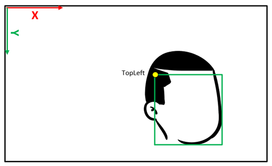

The metadata payload is in the following layout: **WSEFaceMetadataHeader** + 'n' * **WSEFaceTrackingMetadata**
| | |
| -- | -- |
| **WSEFaceMetadataHeader** | <u>**Count** (UINT32)</u>: Count of faces tracked with this metadata  <u>**Size** (UINT32)</u>: Size (bytes) of this entire metadata payload, sizeof(WSEFaceMetadataHeader) + Count * sizeof(WSEFaceTrackingMetadata) |
| **WSEFaceTrackingMetadata** | <u>**TopLeft** (float[2])</u>: Top left corner (x,y) of the bounding box of face in image relative coordinates [0, 1]  <u>**BoxSize** (float[2])</u>: Width and Height of the bounding box of face in image relative coordinates [0, 1] <u>**Confidence** (float)</u>: Confidence of this region being an actual face (0..1) <u>**TrackId** (UINT32)</u>: Corresponding track id to correlate with other metadata
| Any additional **WSEFaceTrackingMetadata** according to WSEFaceMetadataHeader.Count | |

## MF_WINDOWSSTUDIO_METADATA_FACELANDMARKS frame metadata
Produced when the control KSPROPERTY_CAMERACONTROL_WINDOWSSTUDIO_FACEMETADATA is set with a bit mask containing KSCAMERA_WINDOWSSTUDIO_FACEMETADATA_FACELANDMARKS. This metadata contains the 2D facial landmarks of each face tracked in the frame. The landmarks provided follow the Multi-PIE 68 points mark-up scheme and adds 2 extra points, one for each center of the iris, for a total of 70 tracked per face.

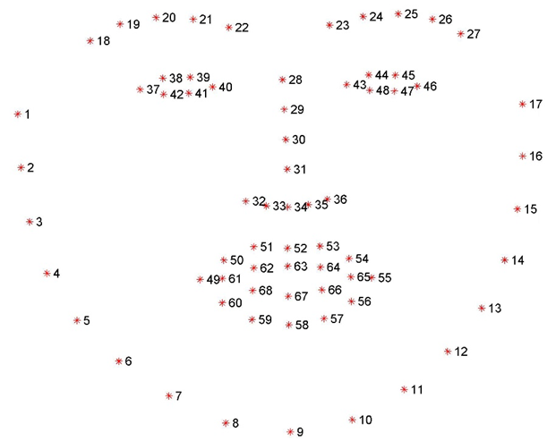

The metadata payload is in the following layout: **WSEFaceMetadataHeader** + 'n' * **WSEFaceLandmarksMetadata**
| | |
| -- | -- |
| **WSEFaceMetadataHeader** | <u>**Count** (UINT32)</u>: Count of faces tracked with this metadata  <u>**Size** (UINT32)</u>: Size (bytes) of this entire metadata payload, sizeof(WSEFaceMetadataHeader) + Count * sizeof(WSEFaceLandmarksMetadata) |
| **WSEFaceLandmarksMetadata** | <u>**Landmarks2D** (float[70][2])</u>: 2D Landmark (x,y) location of faces in image relative coordinates [0, 1]  <u>**Confidence** (float)</u>: Confidence of this region being an actual face (0..1) <u>**TrackId** (UINT32)</u>: Corresponding track id to correlate with other metadata
| Any additional **WSEFaceLandmarksMetadata** according to WSEFaceMetadataHeader.Count | |

## MF_WINDOWSSTUDIO_METADATA_FACEPOSE frame metadata
Produced when the control KSPROPERTY_CAMERACONTROL_WINDOWSSTUDIO_FACEMETADATA is set with a bit mask containing KSCAMERA_WINDOWSSTUDIO_FACEMETADATA_FACEPOSE. This metadata contains the 3D orientation of each face tracked in the frame in Euler angles (pitch, yaw, roll) along each axis (x, y, z) in degrees in a right-handedness coordinate system, where the Z axis points towards the user.

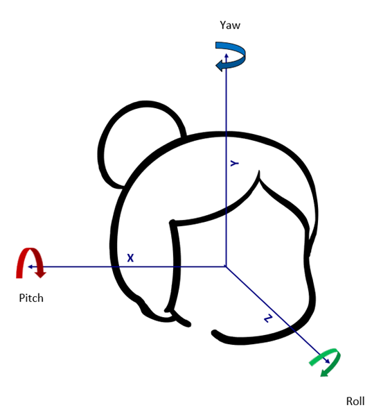

The metadata payload is in the following layout: **WSEFaceMetadataHeader** + 'n' * **WSEFacePoseMetadata**
| | |
| -- | -- |
| **WSEFaceMetadataHeader** | <u>**Count** (UINT32)</u>: Count of faces tracked with this metadata  <u>**Size** (UINT32)</u>: Size (bytes) of this entire metadata payload, sizeof(WSEFaceMetadataHeader) + Count * sizeof(WSEFacePoseMetadata) |
| **WSEFacePoseMetadata** | <u>**Pose** (float[3])</u>: Estimated pose of the face (yaw, pitch, roll)  <u>**Confidence** (float)</u>: Confidence of this region being an actual face (0..1) <u>**TrackId** (UINT32)</u>: Corresponding track id to correlate with other metadata
| Any additional **WSEFacePoseMetadata** according to WSEFaceMetadataHeader.Count | |
----------

----------
## KSPROPERTY_CAMERACONTROL_WINDOWSSTUDIO_AUTOMATICFRAMINGKIND Control
The Automatic Framing Kind DDI allows to query and specify which Automatic Framing solution implemented in *WSE* to leverage when the Digital Window DDI is set with flags to operate automatic face framing (KSCAMERA_EXTENDEDPROP_DIGITALWINDOW_AUTOFACEFRAMING). 

### Usage Summary
| Scope | Control | Type | GET | SET |
| ----- | ----- | ----- | ----- | ----- |
| Version 1 | Filter | Synchronous| ✔️ | ✔️ |

The KSPROPERTY payload follows the same layout as traditional KSPROPERTY_CAMERACONTROL_EXTENDED_PROPERTY, comprised of a [KSCAMERA_EXTENDEDPROP_HEADER](https://learn.microsoft.com/en-us/windows-hardware/drivers/ddi/ksmedia/ns-ksmedia-tagkscamera_extendedprop_header) followed by a content of size of a [KSCAMERA_EXTENDEDPROP_VALUE](https://learn.microsoft.com/en-us/windows-hardware/drivers/ddi/ksmedia/ns-ksmedia-tagkscamera_extendedprop_value).

~~~cpp
// Automatic framing kind possible flags values
#define KSCAMERA_WINDOWSSTUDIO_AUTOMATICFRAMINGKIND_WINDOW 0x0000000000000001
#define KSCAMERA_WINDOWSSTUDIO_AUTOMATICFRAMINGKIND_CINEMATIC  0x0000000000000002
~~~

#### KSCAMERA_EXTENDEDPROP_HEADER
| **Member** | **Description** |
| ----- | ----- |
| **Version** | Must be 1 |
| **PinId** | This must be KSCAMERA_EXTENDEDPROP_FILTERSCOPE (0xFFFFFFFF). |
| **Size** | sizeof(KSCAMERA_EXTENDEDPROP_HEADER) + sizeof(KSCAMERA_EXTENDEDPROP_VALUE) |
| **Result** | Unused, must be 0 |
| **Capability** | Must at least contain a valid flags value or a bit combination of them:  - KSCAMERA_WINDOWSSTUDIO_AUTOMATICFRAMINGKIND_WINDOW - KSCAMERA_WINDOWSSTUDIO_AUTOMATICFRAMINGKIND_CINEMATIC |
| **Flags** | Can be KSCAMERA_WINDOWSSTUDIO_AUTOMATICFRAMINGKIND_WINDOW or KSCAMERA_WINDOWSSTUDIO_AUTOMATICFRAMINGKIND_CINEMATIC |

There are no expectations of default Flags value. In a GET call, *WSE* driver should return the current settings in the Flags field.

----------

# *WSE* Custom DDIs and driver properties intended for driver implementers, OEMs and IHVs

----------
## KSPROPERTY_CAMERACONTROL_WINDOWSSTUDIO_SETNOTIFICATION Control 

>**This DDI is intended for other camera driver component to implement, not application.**

It serves as a way for *WSE* driver component to inform other driver components sitting in the driver stack such as a DMFT that an effect DDI state was modified. This may trigger internal changes in these other driver components to accommodate the state change such as disabling or altering pixel processing accordingly. Therefore a driver component that wants to be notified of a Windows Studio Effects DDI state change may expose support for this KSPROPERTY_CAMERACONTROL_WINDOWSSTUDIO_SETNOTIFICATION DDI.
An example of this could be when *WSE* is requested to turn ON Automatic Framing via the KSProperty KSPROPERTY_CAMERACONTROL_EXTENDED_DIGITALWINDOW; a DeviceMFT may change the way it compensates for lens distortion as to mitigate image quality artifacts when zooming into the fringes of the frame. This notification is sent from *WSE* and relies on each subsequent driver component in the chain to relay it further to the next component. 

>**If a driver component intercepts this KSProperty DDI, it shall as well relay it to the subsequent component for both a SET and a GET in which case it needs to aggregate capability from the next component into its own reported capability**

### Usage Summary
| Scope | Control | Type | GET | SET |
| ----- | ----- | ----- | ----- | ----- |
| Version 1 | Filter | Synchronous| ✔️ | ✔️ |

***For GET call***: the KSPROPERTY payload follows the same layout as traditional KSPROPERTY_CAMERACONTROL_EXTENDED_PROPERTY, comprised of a [KSCAMERA_EXTENDEDPROP_HEADER](https://learn.microsoft.com/en-us/windows-hardware/drivers/ddi/ksmedia/ns-ksmedia-tagkscamera_extendedprop_header) followed by a [KSCAMERA_EXTENDEDPROP_VALUE](https://learn.microsoft.com/en-us/windows-hardware/drivers/ddi/ksmedia/ns-ksmedia-tagkscamera_extendedprop_value). 
The capability field defines which supported SET notifications to receive.

***For SET call***: the KSPROPERTY payload starts in the same layout as traditional KSPROPERTY_CAMERACONTROL_EXTENDED_PROPERTY, comprised of a [KSCAMERA_EXTENDEDPROP_HEADER](https://learn.microsoft.com/en-us/windows-hardware/drivers/ddi/ksmedia/ns-ksmedia-tagkscamera_extendedprop_header), but is followed by a variable payload content of **size of a single KSProperty SET payload linked to the KSCAMERA_WINDOWSSTUDIO_SETNOTIFICATION_\* flags value**.

~~~cpp
// SetNotification possible flags values
#define KSCAMERA_WINDOWSSTUDIO_SETNOTIFICATION_NONE 0x0000000000000000
#define KSCAMERA_WINDOWSSTUDIO_SETNOTIFICATION_DIGITALWINDOW 0x0000000000000001
#define KSCAMERA_WINDOWSSTUDIO_SETNOTIFICATION_EYECORRECTION 0x0000000000000002
#define KSCAMERA_WINDOWSSTUDIO_SETNOTIFICATION_BACKGROUNDSEGMENTATION 0x0000000000000004
#define KSCAMERA_WINDOWSSTUDIO_SETNOTIFICATION_STAGELIGHT 0x0000000000000008
#define KSCAMERA_WINDOWSSTUDIO_SETNOTIFICATION_CREATIVEFILTER 0x0000000000000010
#define KSCAMERA_WINDOWSSTUDIO_SETNOTIFICATION_FACEDETECTION 0x0000000000000020
#define KSCAMERA_WINDOWSSTUDIO_SETNOTIFICATION_LDC 0x0000000000000040
#define KSCAMERA_WINDOWSSTUDIO_SETNOTIFICATION_FACEMETADATA 0x000000000000080
~~~

#### KSCAMERA_EXTENDEDPROP_HEADER
| **Member** | **Description** |
| ----- | ----- |
| **Version** | Must be 1 |
| **PinId** | This must be KSCAMERA_EXTENDEDPROP_FILTERSCOPE (0xFFFFFFFF). |
| **Size** | sizeof(KSCAMERA_EXTENDEDPROP_HEADER) + sizeof(KSCAMERA_EXTENDEDPROP_VALUE) |
| **Result** | Unused, must be 0 |
| **Capability** | ***GET call***: Bitmask of notification supported **(KSCAMERA_WINDOWSSTUDIO_ SETNOTIFICATION_\*) for this component and all the subsequent ones up to this point**. Must at least contain a different valid potential flag value than KSCAMERA_WINDOWSSTUDIO_SETNOTIFICATION_NONE.   ***SET call***: Unused, must be 0
 |
| **Flags** | ***GET call***: Unused, must be 0.   ***SET call***: One of the KSCAMERA_WINDOWSSTUDIO_ SETNOTIFICATION_* value other than KSCAMERA_WINDOWSSTUDIO_SETNOTIFICATION_NONE. |

This is an example of how a device MFT may report support for and relay a  KSPROPERTY_CAMERACONTROL_WINDOWSSTUDIO_SETNOTIFICATION payload.
~~~cpp

// .h
// redefine locally GUID defined in OS SDK ksmedia.h for convenience
static GUID KSPROPERTYSETID_WindowsStudioCameraControl = { 0x1666d655, 0x21a6, 0x4982, 0x97, 0x28, 0x52, 0xc3, 0x9e, 0x86, 0x9f, 0x90 };

// redefine locally
typedef enum {
    KSPROPERTY_CAMERACONTROL_WINDOWSSTUDIO_SUPPORTED = 0,
    KSPROPERTY_CAMERACONTROL_WINDOWSSTUDIO_STAGELIGHT = 1,
    KSPROPERTY_CAMERACONTROL_WINDOWSSTUDIO_CREATIVEFILTER = 2,
    KSPROPERTY_CAMERACONTROL_WINDOWSSTUDIO_SETNOTIFICATION = 3,
    KSPROPERTY_CAMERACONTROL_WINDOWSSTUDIO_PERFORMANCEMITIGATION = 4,
    KSPROPERTY_CAMERACONTROL_WINDOWSSTUDIO_FACEMETADATA = 5,
    KSPROPERTY_CAMERACONTROL_WINDOWSSTUDIO_SENSORCENTERCROP = 6,
    KSPROPERTY_CAMERACONTROL_WINDOWSSTUDIO_AUTOMATICFRAMINGKIND = 7,
    KSPROPERTY_CAMERACONTROL_WINDOWSSTUDIO_UPDATED_VIEWPORT = 8
} KSPROPERTY_CAMERACONTROL_WINDOWSSTUDIO_PROPERTY;

#define KSCAMERA_WINDOWSSTUDIO_SETNOTIFICATION_NONE 0x0000000000000000
#define KSCAMERA_WINDOWSSTUDIO_SETNOTIFICATION_DIGITALWINDOW 0x0000000000000001
#define KSCAMERA_WINDOWSSTUDIO_SETNOTIFICATION_EYECORRECTION 0x0000000000000002
#define KSCAMERA_WINDOWSSTUDIO_SETNOTIFICATION_BACKGROUNDSEGMENTATION 0x0000000000000004
#define KSCAMERA_WINDOWSSTUDIO_SETNOTIFICATION_STAGELIGHT 0x0000000000000008
#define KSCAMERA_WINDOWSSTUDIO_SETNOTIFICATION_CREATIVEFILTER 0x0000000000000010
#define KSCAMERA_WINDOWSSTUDIO_SETNOTIFICATION_FACEDETECTION 0x0000000000000020
#define KSCAMERA_WINDOWSSTUDIO_SETNOTIFICATION_LDC 0x0000000000000040
#define KSCAMERA_WINDOWSSTUDIO_SETNOTIFICATION_FACEMETADATA 0x000000000000080

class SampleDMFT 
    : public IMFDeviceTransform,
// …
{
public:
    HRESULT InitializeTransform(_In_ IMFAttributes* pAttributes) override;
    HRESULT KSProperty(
        _In_reads_bytes_(ulPropertyLength) PKSPROPERTY pProperty,
        _In_ ULONG ulPropertyLength,
        _Inout_updates_to_(ulDataLength, *pulBytesReturned) LPVOID pPropertyData,
        _In_ ULONG ulDataLength,
        _Out_ ULONG* pulBytesReturned) override;
              wil::com_ptr_nothrow <IKsControl> m_spKsControl;
// …
}

// .cpp

///
/// This function is the entry point of the transform. The
/// following things may be initialized here:
/// 1) Query for MF_DEVICEMFT_CONNECTED_FILTER_KSCONTROL on the
/// attributes supplied.
HRESULT SampleDMFT::InitializeTransform(_In_ IMFAttributes *pAttributes)
{
    HRESULT hr = S_OK;
          wil::com_ptr_nothrow<IUnknown> spFilterUnk;
// …
          hr = pAttributes->GetUnknown(MF_DEVICEMFT_CONNECTED_FILTER_KSCONTROL, IID_PPV_ARGS(&spFilterUnk));
    if(hr != S_OK)
    {
        return hr;
    }

    hr = spFilterUnk.query_to(IID_PPV_ARGS(&m_spKsControl));
    if(hr != S_OK)
    {
        return hr;
    }
// …
}

/// 
/// This function is the intercept point for SET/GET KSProperty.
/// This sample shows how to intercept the KSPROPERTY_CAMERACONTROL_WINDOWSTUDIO_SETNOTIFICATION DDI from a DMFT standpoint that wants to be alerted of changes to both DigitalWindow and CreativeFilter DDIs in the Windows Studio Effect driver component.
HRESULT SampleDMFT::KsProperty(
    _In_reads_bytes_(ulPropertyLength) PKSPROPERTY pProperty,
    _In_ ULONG ulPropertyLength,
    _Inout_updates_to_(ulDataLength, *pulBytesReturned) LPVOID pPropertyData,
    _In_ ULONG ulDataLength,
    _Out_ ULONG* pulBytesReturned
)
{
    RETURN_HR_IF_NULL(E_POINTER, pProperty);
    if (ulPropertyLength < sizeof(KSPROPERTY))
    {
        RETURN_IF_FAILED(E_INVALIDARG);
    }

    wil::com_ptr_nothrow<IKsControl> m_spKsControl;

    if (IsEqualCLSID(pProperty->Set, KSPROPERTYSETID_WindowsCameraEffect))
    {   
        if (pProperty->Id == KSPROPERTY_CAMERACONTROL_WINDOWSTUDIO_SETNOTIFICATION)
        {
            // --GET--
            if (pProperty->Flags & KSPROPERTY_TYPE_GET)
            {
                if (ulDataLength < sizeof(KSCAMERA_EXTENDEDPROP_HEADER) + sizeof(KSCAMERA_EXTENDEDPROP_VALUE))
                {
                    *pulBytesReturned = sizeof(KSCAMERA_EXTENDEDPROP_HEADER) + sizeof(KSCAMERA_EXTENDEDPROP_VALUE);
                    return HRESULT_FROM_WIN32(ERROR_MORE_DATA);
                }
                else if (pPropertyData)
                {
                    KSCAMERA_EXTENDEDPROP_HEADER* pExtendedHeader = (KSCAMERA_EXTENDEDPROP_HEADER*)pPropertyData;

                    // query the next driver component and if it supports this DDI, aggregate this DMFT's capability 
                    HRESULT hr = m_spKsControl->KsProperty(pProperty, ulPropertyLength, pPropertyData, ulDataLength, pulBytesReturned);
                    if (hr == S_OK)
                    {
                        pExtendedHeader->Capability |= (KSCAMERA_WINDOWSSTUDIO_SETNOTIFICATION_DIGITALWINDOW | KSCAMERA_WINDOWSSTUDIO_SETNOTIFICATION_CREATIVEFILTER);
                    }
                    else
                    {
                        pExtendedHeader->Capability = (KSCAMERA_WINDOWSSTUDIO_SETNOTIFICATION_DIGITALWINDOW | KSCAMERA_WINDOWSSTUDIO_SETNOTIFICATION_CREATIVEFILTER);
                    }
                    pExtendedHeader->Flags = 0;
                    pExtendedHeader->Result = 0;
                    pExtendedHeader->Size = sizeof(KSCAMERA_EXTENDEDPROP_HEADER) + sizeof(KSCAMERA_EXTENDEDPROP_VALUE);
                    pExtendedHeader->Version = 1;
                    pExtendedHeader->PinId = 0xFFFFFFFF;

                    *pulBytesReturned = pExtendedHeader->Size;
                }
                else
                {
                    return E_INVALIDARG;
                }
            }
            // --SET--
            else if (pProperty->Flags & KSPROPERTY_TYPE_SET)
            {
                ULONG expectedSize = sizeof(KSCAMERA_EXTENDEDPROP_HEADER);
                if (ulDataLength < expectedSize)
                {
                    *pulBytesReturned = expectedSize;
                    return HRESULT_FROM_WIN32(ERROR_MORE_DATA);
                }
                else if (!pPropertyData)
                {
                    return E_INVALIDARG;
                }

                // send the payload to the next driver component, in this case we don't care about the return value
                (void)m_spKsControl->KsProperty(pProperty, ulPropertyLength, pPropertyData, ulDataLength, pulBytesReturned);

                // parse the payload
                BYTE* pPayload = (BYTE*)pPropertyData;
                KSCAMERA_EXTENDEDPROP_HEADER* pExtendedHeader = (KSCAMERA_EXTENDEDPROP_HEADER*)pPayload;

                // if this is a SET notification we care about
                if (KSCAMERA_WINDOWSSTUDIO_SETNOTIFICATION_DIGITALWINDOW == pExtendedHeader->Flags)
                {
                    // we expect the size of the payload for a DigitalWindow SET call, see spec for KSPROPERTY_CAMERACONTROL_EXTENDED_DIGITALWINDOW
                    expectedSize += (sizeof(KSCAMERA_EXTENDEDPROP_HEADER) + sizeof(KSCAMERA_EXTENDEDPROP_DIGITALWINDOW_SETTING));
                    if (ulDataLength < expectedSize)
                    {
                        *pulBytesReturned = expectedSize;
                        return HRESULT_FROM_WIN32(ERROR_MORE_DATA);
                    }

                    KSCAMERA_EXTENDEDPROP_HEADER* pDigitalWindowPayloadExtendedHeader = pExtendedHeader + 1;
                    KSCAMERA_EXTENDEDPROP_DIGITALWINDOW_SETTING* pDigitalWindowPaySettings = (KSCAMERA_EXTENDEDPROP_DIGITALWINDOW_SETTING*)(pDigitalWindowPayloadExtendedHeader + 1);

                    // read the parts of the payload and take action accordingly
                    if (pDigitalWindowPayloadExtendedHeader->Flags == KSCAMERA_EXTENDEDPROP_DIGITALWINDOW_AUTOFACEFRAMING)
                    {
                        // Automatic Framing has been enabled, do something differently internally
                    }
                    else
                    {
                        // Automatic Framing is disabled, read the window bounds used i.e. 
                        // pDigitalWindowPaySettings->OriginX, pDigitalWindowPaySettings->OriginY, pDigitalWindowPaySettings->WindowSize
                        // and do something differently internally
                    }
                }
                else if (KSCAMERA_WINDOWSSTUDIO_SETNOTIFICATION_CREATIVEFILTER == pExtendedHeader->Flags)
                {
                    // we expect the size of the payload for a CreativeFilter SET call, see spec for KSPROPERTY_CAMERACONTROL_WINDOWSSTUDIO_CREATIVEFILTER
                    expectedSize += (sizeof(KSCAMERA_EXTENDEDPROP_HEADER) + sizeof(KSCAMERA_EXTENDEDPROP_VALUE));
                    if (ulDataLength < expectedSize)
                    {
                        *pulBytesReturned = expectedSize;
                        return HRESULT_FROM_WIN32(ERROR_MORE_DATA);
                    }

                    KSCAMERA_EXTENDEDPROP_HEADER* pCreativeFilterPayloadExtendedHeader = pExtendedHeader + 1;
                    // read the parts of the payload and if creative filter is enabled, take action accordingly
                    if (pCreativeFilterPayloadExtendedHeader->Flags != KSCAMERA_WINDOWSSTUDIO_CREATIVEFILTER_OFF)
                    {
                        // Creative filter has been enabled, do something differently internally
                    }
                    else
                    {
                        // Creative filter is disabled, do something differently internally
                    }
                }
                else
                {
                    return E_INVALIDARG;
                }
            }
            // --GETPAYLOAD--
            else if (pProperty->Flags & KSPROPERTY_TYPE_GETPAYLOADSIZE)
            {
                *pulBytesReturned = sizeof(KSCAMERA_EXTENDEDPROP_HEADER) + sizeof(KSCAMERA_EXTENDEDPROP_VALUE);
            }
        }
        else
        {
            return HRESULT_FROM_WIN32(ERROR_NOT_SUPPORTED);
        }
    }
    else
    {
        return HRESULT_FROM_WIN32(ERROR_SET_NOT_FOUND);
    }
    return S_OK;
}
~~~

----------

----------
## KSPROPERTY_CAMERACONTROL_WINDOWSSTUDIO_SENSORCENTERCROP Control 

>**This DDI is intended for other camera driver component to implement, not application.**

The KSPROPERTY_CAMERACONTROL_WINDOWSSTUDIO_SENSORCENTERCROP DDI allows *WSE* to query from a driver component the current sensor center crop performed by the ISP to produce the current output MediaType resolution set on the streams exposed by the source. It is possible that upon starting a stream, the ISP may choose to change the exercised area of the sensor in order to produce frames on 1 or more streams concurrently. If that’s the case, in order to perform correctly both lens distortion correction and the new Cinematic Director type of Automatic Framing, *WSE* need to pull this information. The following DDI is the way for the camera driver to declare this sensor crop information.

Implementing this DDI is optional:
- If this DDI is not supported by the source driver but the above device property keys are exposed (DEVPKEY_WindowsStudio_PinholeIntrinsics, DEVPKEY_WindowsStudio_LensDistortionModel_6k or DEVPKEY_WindowsStudio_LensDistortionModel_PolyLinear) then it is assumed that all MediaTypes are sampled using the maximum area of the sensor allowed by their aspect ratio.

| Example of possible sensor crop | Example values returned via DDI assuming SensorWidth = 3840, SensorHeight = 2640 for the sensor center crop (green) | Example sensor area leveraged to service MediaType (red) |
| -- | -- | -- |
| 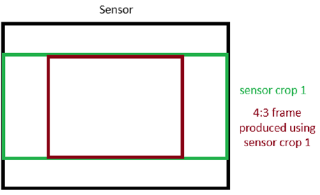 | Size.cx = 3840 Size.cy = 2160 | Mediatype is of resolution 1920 x 1440, We infer then that the sensor area covered is: 2880 x 2160 |
| 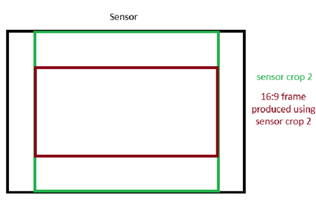 | Size.cx = 3520 Size.cy = 2160 | Mediatype is of resolution 1920 x 1080, We infer then that the sensor area covered is: 2880 x 2160 |
| 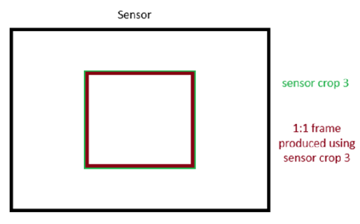 | Size.cx = 1600 Size.cy = 1600 | Mediatype is of resolution 800 x 800, We infer then that the sensor area covered is: 1600 x 1600 |

>**A driver component such as a DMFT that does not implement this DDI call shall relay it to the subsequent component**

### Usage Summary
| Scope | Control | Type | GET | SET |
| ----- | ----- | ----- | ----- | ----- |
| Version 1 | Filter | Synchronous| ✔️ | ❌ |

The KSPROPERTY payload follows the same layout as traditional KSPROPERTY_CAMERACONTROL_EXTENDED_PROPERTY, comprised of a [KSCAMERA_EXTENDEDPROP_HEADER](https://learn.microsoft.com/en-us/windows-hardware/drivers/ddi/ksmedia/ns-ksmedia-tagkscamera_extendedprop_header) followed by a content of size of a [KSCAMERA_EXTENDEDPROP_VALUE](https://learn.microsoft.com/en-us/windows-hardware/drivers/ddi/ksmedia/ns-ksmedia-tagkscamera_extendedprop_value) that actualy contains only a struct of type [SIZE](https://learn.microsoft.com/en-us/windows/win32/api/windef/ns-windef-size) (64 bits, see *windef.h*) detailing the current center crop width and height in pixels given the output MediaType(s) set on the available stream(s).

This is a GET only DDI, a SET call of this control will fail.

#### KSCAMERA_EXTENDEDPROP_HEADER
| **Member** | **Description** |
| ----- | ----- |
| **Version** | Must be 1 |
| **PinId** | This must be KSCAMERA_EXTENDEDPROP_FILTERSCOPE (0xFFFFFFFF). |
| **Size** | sizeof(KSCAMERA_EXTENDEDPROP_HEADER) + sizeof(KSCAMERA_EXTENDEDPROP_VALUE) |
| **Result** | Unused, must be 0 |
| **Capability** | Unused, must be 0 |
| **Flags** | Unused, must be 0 |
#### SIZE
| **Member** | **Description** |
| ----- | ----- |
| **cx** | Sensor center crop width in pixels |
| **cy** | Sensor center crop height in pixels |

This is an example of how a device MFT may report support for and relay the current KSPROPERTY_CAMERACONTROL_WINDOWSSTUDIO_SENSORCENTERCROP payload.
~~~cpp
// .h
// redefine locally GUID defined in OS SDK ksmedia.h for convenience
static GUID KSPROPERTYSETID_WindowsStudioCameraControl = { 0x1666d655, 0x21a6, 0x4982, 0x97, 0x28, 0x52, 0xc3, 0x9e, 0x86, 0x9f, 0x90 };

// redefine locally
typedef enum {
    KSPROPERTY_CAMERACONTROL_WINDOWSSTUDIO_SUPPORTED = 0,
    KSPROPERTY_CAMERACONTROL_WINDOWSSTUDIO_STAGELIGHT = 1,
    KSPROPERTY_CAMERACONTROL_WINDOWSSTUDIO_CREATIVEFILTER = 2,
    KSPROPERTY_CAMERACONTROL_WINDOWSSTUDIO_SETNOTIFICATION = 3,
    KSPROPERTY_CAMERACONTROL_WINDOWSSTUDIO_PERFORMANCEMITIGATION = 4,
    KSPROPERTY_CAMERACONTROL_WINDOWSSTUDIO_FACEMETADATA = 5,
    KSPROPERTY_CAMERACONTROL_WINDOWSSTUDIO_SENSORCENTERCROP = 6,
    KSPROPERTY_CAMERACONTROL_WINDOWSSTUDIO_AUTOMATICFRAMINGKIND = 7,
    KSPROPERTY_CAMERACONTROL_WINDOWSSTUDIO_UPDATED_VIEWPORT = 8
} KSPROPERTY_CAMERACONTROL_WINDOWSSTUDIO_PROPERTY;

class SampleDMFT 
    : public IMFDeviceTransform,
// …
{
public:
    HRESULT InitializeTransform(_In_ IMFAttributes* pAttributes) override;
    HRESULT KSProperty(
        _In_reads_bytes_(ulPropertyLength) PKSPROPERTY pProperty,
        _In_ ULONG ulPropertyLength,
        _Inout_updates_to_(ulDataLength, *pulBytesReturned) LPVOID pPropertyData,
        _In_ ULONG ulDataLength,
        _Out_ ULONG* pulBytesReturned) override;
              wil::com_ptr_nothrow <IKsControl> m_spKsControl;
// …
}

// .cpp

///
/// This function is the entry point of the transform. The
/// following things may be initialized here:
/// 1) Query for MF_DEVICEMFT_CONNECTED_FILTER_KSCONTROL on the
/// attributes supplied.
HRESULT SampleDMFT::InitializeTransform(_In_ IMFAttributes *pAttributes)
{
    HRESULT hr = S_OK;
          wil::com_ptr_nothrow<IUnknown> spFilterUnk;
// …
          hr = pAttributes->GetUnknown(MF_DEVICEMFT_CONNECTED_FILTER_KSCONTROL, IID_PPV_ARGS(&spFilterUnk));
    if(hr != S_OK)
    {
        return hr;
    }

    hr = spFilterUnk.query_to(IID_PPV_ARGS(&m_spKsControl));
    if(hr != S_OK)
    {
        return hr;
    }
// …
}

/// 
/// This function is the intercept point for SET/GET KSProperty.
/// This sample shows how to intercept the KSPROPERTY_CAMERACONTROL_WINDOWSTUDIO_SENSORCENTERCROP DDI from a DMFT standpoint that wants to declare the current sensor center crop exercised by the ISP.
HRESULT SampleDMFT::KsProperty(
    _In_reads_bytes_(ulPropertyLength) PKSPROPERTY pProperty,
    _In_ ULONG ulPropertyLength,
    _Inout_updates_to_(ulDataLength, *pulBytesReturned) LPVOID pPropertyData,
    _In_ ULONG ulDataLength,
    _Out_ ULONG* pulBytesReturned
)
{
    RETURN_HR_IF_NULL(E_POINTER, pProperty);
    if (ulPropertyLength < sizeof(KSPROPERTY))
    {
        RETURN_IF_FAILED(E_INVALIDARG);
    }

    wil::com_ptr_nothrow<IKsControl> m_spKsControl;

    if (IsEqualCLSID(pProperty->Set, KSPROPERTYSETID_WindowsCameraEffect))
    {   
        if (pProperty->Id == KSPROPERTY_CAMERACONTROL_WINDOWSTUDIO_SENSORCENTERCROP)
        {
            // --GET--
            if (pProperty->Flags & KSPROPERTY_TYPE_GET)
            {
                if (ulDataLength < sizeof(KSCAMERA_EXTENDEDPROP_HEADER) + sizeof(KSCAMERA_EXTENDEDPROP_VALUE))
                {
                    *pulBytesReturned = sizeof(KSCAMERA_EXTENDEDPROP_HEADER) + sizeof(KSCAMERA_EXTENDEDPROP_VALUE);
                    return HRESULT_FROM_WIN32(ERROR_MORE_DATA);
                }
                else if (pPropertyData)
                {
                    KSCAMERA_EXTENDEDPROP_HEADER* pExtendedHeader = (KSCAMERA_EXTENDEDPROP_HEADER*)pPropertyData;
                    SIZE* pSensorCropDimension = (SIZE*)(pExtendedHeader + 1);

                    // return the current sensor crop exercised to produce frames 
                    pExtendedHeader->Capability 0;
                    pExtendedHeader->Flags = 0;
                    pExtendedHeader->Result = 0;
                    pExtendedHeader->Size = sizeof(KSCAMERA_EXTENDEDPROP_HEADER) + sizeof(KSCAMERA_EXTENDEDPROP_VALUE);
                    pExtendedHeader->Version = 1;
                    pExtendedHeader->PinId = 0xFFFFFFFF;
                    
                    // in this example we return that ISP uses a 16:9 sensor center crop (3200x1800)
		   *pSensorCropDimension = {3200, 1800};

                    *pulBytesReturned = pExtendedHeader->Size;
                }
                else
                {
                    return E_INVALIDARG;
                }
            }
            // --SET--
            else
            {
                return E_INVALIDARG;
            }  
        }
        // other property id than KSPROPERTY_CAMERACONTROL_WINDOWSTUDIO_SENSORCENTERCROP..
        else
        {
            return HRESULT_FROM_WIN32(ERROR_NOT_SUPPORTED);
        }
    }
    // other property set than KSPROPERTYSETID_WindowsCameraEffect..
    else
    {
        return HRESULT_FROM_WIN32(ERROR_SET_NOT_FOUND);
    }
    return S_OK;
}
~~~

----------

----------
##  KSPROPERTY_CAMERACONTROL_WINDOWSSTUDIO_UPDATED_VIEWPORT Control 

>**This DDI is intended for other camera driver component to implement, not application.**

This DDI allows a driver component running prior to *WSE* to be notified of a viewport update. *WSE* may crop its input frames using the provided set of corners in order to produce its output frames. This is the case such as when applying Automatic Framing, correcting lens distortion or when adjusting field of view, pan or tilt values. The viewport is a quadrilateral and not necessarily a rectangle. *WSE* will query for the support of this DDI and if the driver reports support, then *WSE* will send down the viewport corners from its input image accordingly where each relative coordinate of a corner is in floating point in Q31 format.

Implementing this DDI is optional:
- If this DDI is not supported by the source driver but the above device property keys are exposed (DEVPKEY_WindowsStudio_PinholeIntrinsics, DEVPKEY_WindowsStudio_LensDistortionModel_6k or DEVPKEY_WindowsStudio_LensDistortionModel_PolyLinear) then it is assumed that all MediaTypes are sampled using the maximum area of the sensor allowed by their aspect ratio.

| Input image to *WSE*, green cropping quadrilateral corners in red. Those red points coordinates are sent down to driver if the DDI is supported. | WSE output image resulting from cropping the input image using the green quadrilateral |
| -- | -- |
| 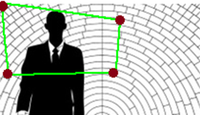 |  |

>**If a driver component intercepts this KSProperty DDI, it shall relay any SET payload if supported to the subsequent component in which case it needs to adjust coordinates according to its own manipulation of the viewport if there are any**

### Usage Summary
| Scope | Control | Type | GET | SET |
| ----- | ----- | ----- | ----- | ----- |
| Version 1 | Filter | Synchronous| ✔️ | ✔️ |

The KSPROPERTY payload follows the following layout: a [KSCAMERA_EXTENDEDPROP_HEADER](https://learn.microsoft.com/en-us/windows-hardware/drivers/ddi/ksmedia/ns-ksmedia-tagkscamera_extendedprop_header) followed by a content payload of type ***WSEViewportCorners***.

~~~cpp
// custom struct containing the coordinates of the corners for the updated viewport sampled by WSE from its input frame to produce its output frame
struct WSEViewportCorners
{
  POINT TopLeft;
  POINT TopRight;
  POINT BottomRight;
  POINT BottomLeft;
};
~~~

#### KSCAMERA_EXTENDEDPROP_HEADER
| **Member** | **Description** |
| ----- | ----- |
| **Version** | Must be 1 |
| **PinId** | This must be KSCAMERA_EXTENDEDPROP_FILTERSCOPE (0xFFFFFFFF). |
| **Size** | sizeof(KSCAMERA_EXTENDEDPROP_HEADER) + sizeof(KSCAMERA_EXTENDEDPROP_VALUE) |
| **Result** | Unused, must be 0 |
| **Capability** | Unused, must be 0 |
| **Flags** | Unused, must be 0 |
#### WSEViewportCorners
| **Member** | **Description** |
| ----- | ----- |
| **TopLeft** | (LONG x, LONG y) top left corner in relative coordinates, floating points in Q31 format |
| **TopRight** | (LONG x, LONG y) top right corner in relative coordinates, floating points in Q31 format |
| **BottomRight** | (LONG x, LONG y) bottom right corner in relative coordinates, floating points in Q31 format |
| **BottomLeft** | (LONG x, LONG y) bottom left corner in relative coordinates, floating points in Q31 format |

This is an example of how a DMFT would support KSPROPERTY_CAMERACONTROL_WINDOWSSTUDIO_UPDATED_VIEWPORT:
~~~cpp
// .h
// redefine locally GUID defined in OS SDK ksmedia.h for convenience
static GUID KSPROPERTYSETID_WindowsStudioCameraControl = { 0x1666d655, 0x21a6, 0x4982, 0x97, 0x28, 0x52, 0xc3, 0x9e, 0x86, 0x9f, 0x90 };

typedef enum {
    KSPROPERTY_CAMERACONTROL_WINDOWSSTUDIO_SUPPORTED = 0,
    KSPROPERTY_CAMERACONTROL_WINDOWSSTUDIO_STAGELIGHT = 1,
    KSPROPERTY_CAMERACONTROL_WINDOWSSTUDIO_CREATIVEFILTER = 2,
    KSPROPERTY_CAMERACONTROL_WINDOWSSTUDIO_SETNOTIFICATION = 3,
    KSPROPERTY_CAMERACONTROL_WINDOWSSTUDIO_PERFORMANCEMITIGATION = 4,
    KSPROPERTY_CAMERACONTROL_WINDOWSSTUDIO_FACEMETADATA = 5,
    KSPROPERTY_CAMERACONTROL_WINDOWSSTUDIO_SENSORCENTERCROP = 6,
    KSPROPERTY_CAMERACONTROL_WINDOWSSTUDIO_AUTOMATICFRAMINGKIND = 7,
    KSPROPERTY_CAMERACONTROL_WINDOWSSTUDIO_UPDATED_VIEWPORT = 8
    // …
} KSPROPERTY_CAMERACONTROL_WINDOWSSTUDIO_PROPERTY;

struct WSEViewportCorners
{
  POINT TopLeft;
  POINT TopRight;
  POINT BottomRight;
  POINT BottomLeft;
};

// helper function to derive floating point representation in Q(n)
constexpr
LONGLONG
BASE_Q(ULONG n)
{
    return (((LONGLONG)1) << n);
}

// Returns the value from x in fixed - point Q31 format.
constexpr
float
FROM_Q31(LONGLONG x)
{
    return (float)x / (float)BASE_Q(31);
}

class SampleDMFT 
    : public IMFDeviceTransform,
// …
{
public:
    HRESULT InitializeTransform(_In_ IMFAttributes* pAttributes) override;
    HRESULT KSProperty(
        _In_reads_bytes_(ulPropertyLength) PKSPROPERTY pProperty,
        _In_ ULONG ulPropertyLength,
        _Inout_updates_to_(ulDataLength, *pulBytesReturned) LPVOID pPropertyData,
        _In_ ULONG ulDataLength,
        _Out_ ULONG* pulBytesReturned) override;
              wil::com_ptr_nothrow <IKsControl> m_spKsControl;

    ULONG m_imageWidth;
    ULONG m_imageHeight;

// …
}

// .cpp

///
/// This function is the entry point of the transform. The
/// following things may be initialized here:
/// 1) Query for MF_DEVICEMFT_CONNECTED_FILTER_KSCONTROL on the
/// attributes supplied.
HRESULT SampleDMFT::InitializeTransform(_In_ IMFAttributes *pAttributes)
{
    HRESULT hr = S_OK;
          wil::com_ptr_nothrow<IUnknown> spFilterUnk;
// …
          hr = pAttributes->GetUnknown(MF_DEVICEMFT_CONNECTED_FILTER_KSCONTROL, IID_PPV_ARGS(&spFilterUnk));
    if(hr != S_OK)
    {
        return hr;
    }

    hr = spFilterUnk.query_to(IID_PPV_ARGS(&m_spKsControl));
    if(hr != S_OK)
    {
        return hr;
    }
// …
}

/// 
/// This function is the intercept point for SET/GET KSProperty.
/// This sample shows how to intercept the KSPROPERTY_CAMERACONTROL_WINDOWSTUDIO_UPDATED_VIEWPORT DDI from a DMFT standpoint.
HRESULT SampleDMFT::KsProperty(
    _In_reads_bytes_(ulPropertyLength) PKSPROPERTY pProperty,
    _In_ ULONG ulPropertyLength,
    _Inout_updates_to_(ulDataLength, *pulBytesReturned) LPVOID pPropertyData,
    _In_ ULONG ulDataLength,
    _Out_ ULONG* pulBytesReturned
)
{
    RETURN_HR_IF_NULL(E_POINTER, pProperty);
    if (ulPropertyLength < sizeof(KSPROPERTY))
    {
        RETURN_IF_FAILED(E_INVALIDARG);
    }

    // obtain IKsControl for the driver stack below..
    wil::com_ptr_nothrow<IKsControl> m_spKsControl;

    if (IsEqualCLSID(pProperty->Set, KSPROPERTYSETID_WindowsCameraEffect))
    {   
        if (pProperty->Id == KSPROPERTY_CAMERACONTROL_WINDOWSTUDIO_UPDATED_VIEWPORT)
        {
            if (ulDataLength < sizeof(KSCAMERA_EXTENDEDPROP_HEADER) + sizeof(WSEViewportCorners))
            {
                *pulBytesReturned = sizeof(KSCAMERA_EXTENDEDPROP_HEADER) + sizeof(WSEViewportCorners);
                 return HRESULT_FROM_WIN32(ERROR_MORE_DATA);
            }
            if (pPropertyData == nullptr)
            {
                return E_INVALIDARG;
            }

            // --GET--
            if (pProperty->Flags & KSPROPERTY_TYPE_GET)
            {
                if (pPropertyData)
                {
                    KSCAMERA_EXTENDEDPROP_HEADER* pExtendedHeader = (KSCAMERA_EXTENDEDPROP_HEADER*)pPropertyData;

                    pExtendedHeader->Flags = 0;
                    pExtendedHeader->Result = 0;
                    pExtendedHeader->Capability = 0;
                    pExtendedHeader->Size = sizeof(KSCAMERA_EXTENDEDPROP_HEADER) + sizeof(WSEViewportCorners);
                    pExtendedHeader->Version = 1;
                    pExtendedHeader->PinId = 0xFFFFFFFF;

                    *pulBytesReturned = pExtendedHeader->Size;
                }
            }
            // --SET--
            else if (pProperty->Flags & KSPROPERTY_TYPE_SET)
            {                
                // parse the payload
                BYTE* pPayload = (BYTE*)pPropertyData;
                KSCAMERA_EXTENDEDPROP_HEADER* pExtendedHeader = (KSCAMERA_EXTENDEDPROP_HEADER*)pPayload;
                WSEViewportCorners* pViewportCorners = (WSEViewportCorners *)pPayload;

                // handle the corners relative coordinates in Q31 format, and retrieve absolute image coordinates
                ULONG topLeftAbsoluteX = FROM_Q31(pViewportCorners->TopLeft.x) * m_imageWidth;
        ULONG topLeftAbsoluteY = FROM_Q31(pViewportCorners->TopLeft.y) * m_imageHeight;
                ULONG topRightAbsoluteX = FROM_Q31(pViewportCorners->TopRight.x) * m_imageWidth;
        ULONG topRightAbsoluteY = FROM_Q31(pViewportCorners->TopRight.y) * m_imageHeight;
                ULONG bottomRightAbsoluteX = FROM_Q31(pViewportCorners->BottomRight.x) * m_imageWidth;
        ULONG bottomRightAbsoluteY = FROM_Q31(pViewportCorners->BottomRight.y) * m_imageHeight;
                ULONG bottomLeftAbsoluteX = FROM_Q31(pViewportCorners->BottomLeft.x) * m_imageWidth;
        ULONG bottomLeftAbsoluteY = FROM_Q31(pViewportCorners->BottomLeft.y) * m_imageHeight;

                // …

            }
            // --GETPAYLOAD--
            else if (pProperty->Flags & KSPROPERTY_TYPE_GETPAYLOADSIZE)
            {
                *pulBytesReturned = sizeof(KSCAMERA_EXTENDEDPROP_HEADER) + sizeof(WSEViewportCorners);
            }
        }
        else
        {
            return HRESULT_FROM_WIN32(ERROR_NOT_SUPPORTED);
        }
    }
    else
    {
        return HRESULT_FROM_WIN32(ERROR_SET_NOT_FOUND);
    }

    // relay to the next driver component
    (void)m_spKsControl->KsProperty(pProperty, ulPropertyLength, pPropertyData, ulDataLength, pulBytesReturned);
                    
    return S_OK;
}
~~~

----------

----------

# *WSE* Device properties
Windows Studio camera will also behave differently given a certain set of custom device properties. This section details those device properties and their effect.

##  High resolution modes

|  |  |
| -- | -- |
| **Name** | DEVPKEY_WindowsStudio_ScaleFromHigherResolution |
| **Property GUID** | AA3E8B1E-B590-4E50-90C6-780AEC4EB4D9 |
| **Property ID** | 2 |
| **Type** | DEVPROP_TYPE_UINT32 |
| **Required** | Optional |
| **Values** | 0 – disabled   1 – HighRes mode 1 enabled   2 – HighRes mode 2 enabled   3 – HighRes mode 3 enabled |

#### C++ definition:

~~~cpp
// define locally GUID for Windows Studio DEVPROPKEY
DEFINE_DEVPROPKEY(DEVPKEY_WindowsStudio_ScaleFromHigherResolution, 
    0xaa3e8b1e, 0xb590, 0x4e50, 0x90, 0xc6, 0x78, 0xa, 0xec, 0x4e, 0xb4, 0xd9, 2); /* DEVPROP_TYPE_UINT32 */
~~~

#### .inf excerpt to define the above property:
~~~
[Camera.AddProperty]
; Set property to operate in high resolution mode, potentially starting the stream at a higher resolution than the output from WSE. In this example high resolution mode is set to 3

{AA3E8B1E-B590-4E50-90C6-780AEC4EB4D9},2,7,,3
~~~

The optional device property *DEVPKEY_WindowsStudio_ScaleFromHigherResolution* is a UINT32 value that enables the Windows Studio camera component to attempt to stream from its source and process at a higher input resolution than what it outputs. This can enhance image quality when applying effects such as Automatic Framing. Therefore, if the app’s desired resolution triggers a higher resolution from the source to be used under the hood by *WSE* as input, it may consume more compute resources which comes as a tradeoff for better image quality. The higher resolution chosen correlates with the desired framerate and aspect ratio of the MediaType requested by the application at up to the maximum input capability in *WSE* i.e. up to 1440p (see below diagram for each presets)

There are 3 types of high resolution mode that can be specified:

1. When the DEVPROP_TYPE_UINT32 value is set to "1", it requests *WSE* to attempt to use the highest resolution supported at all time. For example, if application desires 640x360@30fps, if the driver advertises a MediaType of 2560x1440@30fps, then WSE would stream at 2560x1440@30fps from the base camera, process all effects at that resolution then scale and output the frame at 640x360@30fps:
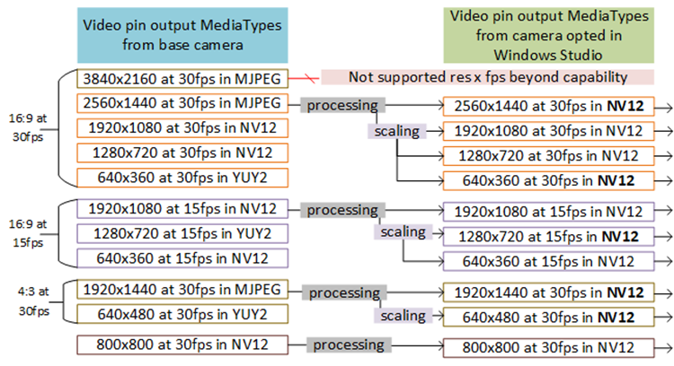

2. When the DEVPROP_TYPE_UINT32 value is set to "2", it requests MEP to attempt to use the highest resolution that is closest to 4 times the pixel resolution to the desired output (i.e. closest to 2xWidth and 2xHeight). For example, if application desires 640x360@30fps, if the driver advertises a MediaType of 1280x720@30fps, then WSE would stream at 1280x720@30fps from the base camera, process all effects at that resolution then scale and output the frame at 640x360@30fps:
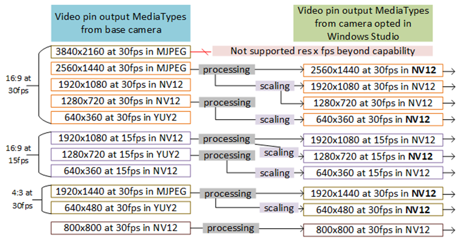

3. When the DEVPROP_TYPE_UINT32 value is set to "3", MEP will change its behavior dynamically given the state of the Automatic Framing effect.
    1. It will behave as if the value was set to "2" when the Automatic Framing effect is turned ON. 
    2. If the Automatic Framing is turned OFF, it will behave as if the value was "0", meaning it will not attempt to stream at a higher resolution. 

   This mode of operation will therefore potentially switch the base camera MediaType on the fly when Automatic Framing is engaged or disengaged (i.e. if the MediaType requested by the app is not what MEP would leverage from the camera driver in "High Res mode 2") causing a stream restart which may have some drawbacks that demand careful consideration:
   - While switching MediaType, the stream needs to be restarted which may drop some frames, appearing as if the frame froze for that amount of time.
   - When switching MediaType, the camera driver may reset its 3A (auto-white balance, auto-focus, auto-exposure) causing a "flicker" image quality artifact
   - The hardware LED that notifies when the camera is turned on may be turned off then on again when engaging or disengaging Automatic Framing due to the stream restarting
This "High Res mode 3" is only supported on Windows build 26100 and above with latest MEP driver.

----------

##  High resolution mode conditional on power state

|  |  |
| -- | -- |
| **Name** | DEVPKEY_WindowsStudio_HighResolutionModeOverrideInDC |
| **Property GUID** | AA3E8B1E-B590-4E50-90C6-780AEC4EB4D9 |
| **Property ID** | 3 |
| **Type** | DEVPROP_TYPE_UINT32 |
| **Required** | Optional, has no effect if the other property *DEVPKEY_WindowsStudio_ScaleFromHigherResolution* is set to 0 or not specified |
| **Values** | 0 – disabled   1 – enabled |

#### C++ definition:

~~~cpp
// define locally GUID for Windows Studio DEVPROPKEY
DEFINE_DEVPROPKEY(DEVPKEY_WindowsStudio_HighResolutionModeOverrideInDC, 
    0xaa3e8b1e, 0xb590, 0x4e50, 0x90, 0xc6, 0x78, 0xa, 0xec, 0x4e, 0xb4, 0xd9, 3); /* DEVPROP_TYPE_UINT32 */
~~~

#### .inf excerpt to define the above property:
~~~
[Camera.AddProperty]
; Set property to operate in the high resolution mode specified by the value of DEVPKEY_WindowsStudio_ScaleFromHigherResolution only when the device is plugged in when the stream is started. If the device is using its battery instead at the moment the stream is started, then the high resolution mode is disabled (DEVPKEY_WindowsStudio_ScaleFromHigherResolution == 0).

{AA3E8B1E-B590-4E50-90C6-780AEC4EB4D9},3,7,,1
~~~

The optional device property *DEVPKEY_WindowsStudio_HighResolutionModeOverrideInDC* is a UINT32 value that adds a condition for Windows Studio camera component when attempting to leverage the high resolution mode prescribed by the other device property named *DEVPKEY_WindowsStudio_ScaleFromHigherResolution* when starting a stream. 
- if the device is in DC power (battery) when the stream starts, this property causes an override and disables the high resolution mode.
- Similarly, if the device is feeding from AC power (plugged-in) when the stream is started then the device may be streaming at a higher resolution.

**This property will not cause a dynamic change of the stream resolution if the power state changes while the stream is running; this condition only applies upon starting the stream.**

----------

##  Face detection DDI support and frequency of face-based ROIs for 3A driven by *WSE*

|  |  |
| -- | -- |
| **Name** | DEVPKEY_WindowsStudio_ImplementFaceDetectionFor3A |
| **Property GUID** | EAC24D1C-F801-4EC7-BBA6-A8B38314FFE5 |
| **Property ID** | 2 |
| **Type** | DEVPROP_TYPE_UINT32 |
| **Required** | Optional |
| **Values** | 0 – disabled   1 – enabled |

|  |  |
| -- | -- |
| **Name** | DEVPKEY_WindowsStudio_3AFaceROIIntervalInMs |
| **Property GUID** | EAC24D1C-F801-4EC7-BBA6-A8B38314FFE5 |
| **Property ID** | 3 |
| **Type** | DEVPROP_TYPE_UINT32 |
| **Required** | Optional, requires *DEVPKEY_WindowsStudio_ImplementFaceDetectionFor3A* to be specified |
| **Values** | Interval in milliseconds at which face-based ROI(s) are evaluated and sent down to adjust 3A. This interval is then aligned with framerate where once a frame with timestamp ‘t’ is used to calculate ROI, the next frame with timestamp > ‘t + value’ is used.  This serves also as the minimum interval at which face detection is run and therefore the sample metadata is refreshed. |

#### C++ definition:

~~~cpp
// define locally GUID for Windows Studio DEVPROPKEY
DEFINE_DEVPROPKEY(DEVPKEY_WindowsStudio_ImplementFaceDetectionFor3A,
    0xeac24d1c, 0xf801, 0x4ec7, 0xbb, 0xa6, 0xa8, 0xb3, 0x83, 0x14, 0xff, 0xe5, 2); /* DEVPROP_TYPE_UINT32 */

DEFINE_DEVPROPKEY(DEVPKEY_WindowsStudio_3AFaceROIIntervalInMs,
    0xeac24d1c, 0xf801, 0x4ec7, 0xbb, 0xa6, 0xa8, 0xb3, 0x83, 0x14, 0xff, 0xe5, 3); /* DEVPROP_TYPE_UINT32 */
~~~

#### .inf excerpt to define the above property:
~~~
[Camera.AddProperty]
; Set property to operate face detection in Windows Studio and execute face detection at least every 200ms. If the driver supports the DDI for receiving ROI for ISP 3A, face-based ROIs will also be refreshed every 200ms

{EAC24D1C-F801-4EC7-BBA6-A8B38314FFE5},2,7,,1
{EAC24D1C-F801-4EC7-BBA6-A8B38314FFE5},3,7,,200
~~~

The optional device property *DEVPKEY_WindowsStudio_ImplementFaceDetectionFor3A* is a UINT32 value that enables (value = 1) or disables (value = 0) standalone face detection capability in Windows Studio camera component applied to any one of video record or video preview stream. 
- If this device property is not specified in the .inf of a camera opting into Windows Studio Effect, its default value is 0. 
- However, if the camera is opted into Windows Studio Effect by other means than .inf such as manually by the user, the default value is instead 1.

When enabled, this has the effect that Windows Studio camera component now supports the camera extended control [KSPROPERTY_CAMERACONTROL_EXTENDED_FACEDETECTION](https://learn.microsoft.com/en-us/windows-hardware/drivers/stream/ksproperty-cameracontrol-extended-facedetection). Per specification, if the client enables face detection via this DDI, the detected face regions of interest (ROIs) are then attached to each sample flowing out of the Windows Studio camera component via a supported stream (see [MF_CAPTURE_METADATA_FACEROIS](https://learn.microsoft.com/en-us/windows-hardware/drivers/stream/mf-capture-metadata#mf_capture_metadata_facerois)).

Additionally, similar to the [OS Platform DMFT](https://learn.microsoft.com/en-us/windows-hardware/drivers/stream/uvc-camera-implementation-guide#platform-device-mft) , if the base driver supports [KSPROPERTY_CAMERACONTROL_EXTENDED_ROI_ISPCONTROL](https://learn.microsoft.com/en-us/windows-hardware/drivers/stream/ksproperty-cameracontrol-extended-facedetection), Windows Studio camera component will drive 3A using up to 2 predominant face ROIs. If both Platform DMFT and Windows Studio are opted-in and this device property is enabled, then only Windows Studio would perform this role, deactivating the redundant logic in Platform DMFT. 

The optional device property *DEVPKEY_WindowsStudio_3AFaceROIIntervalInMs* prescribes the minimum time interval in milliseconds at which the Windows Studio camera component will send down the ROI(s) via KSPROPERTY_CAMERACONTROL_EXTENDED_ROI_ISPCONTROL. This interval is then aligned with framerate where once a frame with timestamp ‘t’ is used to calculate face ROI(s), the next frame with timestamp > ‘t + value’ is used to reassess the detection of face(s) and send down accordingly either a new set of ROI(s) or a reset if no face is detected.

The property *DEVPKEY_WindowsStudio_ImplementFaceDetectionFor3A* must be specified if the property *DEVPKEY_WindowsStudio_3AFaceROIIntervalInMs* is specified.
If *DEVPKEY_WindowsStudio_3AFaceROIIntervalInMs* is not specified, the implicit default value shall be 200ms.

----------

## Camera intrinsics and lens distortion model

###  Lens distortion correction
Lens distortion correction improves the visual quality of images captured by cameras with wide field of view (WFOV). This functionality aims to reduce the "fish-eye" effect that can occur with such cameras, providing a more natural and accurate representation of the scene.

- Lens distortion correction requires both device properties described below: pinhole intrinsics camera parameters and the lens distortion model (which can be expressed in one of the 2 defined formats)
   -  If deemed necessary in the camera driver stack running prior to *WSE*, we also provide a mean to obtain the active sensor region that may have been center-cropped further than the full sensor area cropped to fit the aspect ratio of the frame (see [sensor crop mode DDI](#ksproperty_cameracontrol_windowsstudio_sensorcentercrop-control)). *WSE* can also notify that driver stack of which portion of its input frame is leveraged to produce its output frame (i.e. the viewport leveraged when applying lens distortion correction, field of view adjustments such as zooming, panning and tilting) (see [viewport update DDI](#ksproperty_cameracontrol_windowsstudio_updated_viewport-control))
   -  If the camera driver prefers to perform its own lens distortion correction, then this feature can be left unsupported, else this functionality should only be performed by *WSE* to avoid incorrect redundant processing.
   -  Lens distortion correction is applied on all color streams and always active. This processing is not an effect that the user toggles ON or OFF via the Windows settings UIs.

-  When *WSE* is enabled to perform lens distortion correction, it will also implement the camera DDIs for zooming by adjusting the field of view (see [KSPROPERTY_CAMERACONTROL_EXTENDED_FIELDOFVIEW2](https://learn.microsoft.com/en-us/windows-hardware/drivers/stream/ksproperty-cameracontrol-extended-fieldofview2) and [KSPROPERTY_CAMERACONTROL_EXTENDED_FIELDOFVIEW2_CONFIGCAPS](https://learn.microsoft.com/en-us/windows-hardware/drivers/stream/ksproperty-cameracontrol-extended-fieldofview2-configcaps)) as well as panning and tilting (see [KSPROPERTY_CAMERACONTROL_PAN](https://learn.microsoft.com/en-us/windows-hardware/drivers/stream/ksproperty-cameracontrol-pan) and [KSPROPERTY_CAMERACONTROL_TILT](https://learn.microsoft.com/en-us/windows-hardware/drivers/stream/ksproperty-cameracontrol-tilt))
   -  If the camera driver stack running prior to  *WSE* already implemented these DDIs, *WSE* will override their implementation with its own to ensure that lens distortion correction is correctly aligned.

Microsoft strongly recommends enabling Lens Distortion Correction on Wide and Ultra-Wide FOV integrated front-facing cameras:

- Wide:  16-24mm | Diagonal FOV >= 84° and < 110°
- Ultrawide:  < 16mm | Diagonal FOV >= 110°

###	Pinhole intrinsics device property key
The following device property key defines the format to declare the camera intrinsic parameters in a driver: *DEVPKEY_WindowsStudio_PinholeIntrinsics*. 
- If this information is provided, *WSE* can perform [Cinematic automatic framing](#ksproperty_cameracontrol_windowsstudio_automaticframingkind-control) more faithfully, especially when the subject is located at the edges of the camera field of view. This is done by applying a perspective transform mimicking a camera pivoting towards the subject as opposed to simply cropping the area of the frame like traditional automatic framing method. 
- This device property also allows *WSE* to derive the actual field of view of the camera and optimize other effects around it such as blur.
- This device property is **required** in order for *WSE* to exercise Lens distortion correction.

|  |  |
| -- | -- |
| **Name** | DEVPKEY_WindowsStudio_PinholeIntrinsics |
| **Property GUID** | 0A6244AF-D455-4A0F-B43E-F29507A7DEB6 |
| **Property ID** | 2 |
| **Type** | DEVPROP_TYPE_STRING |
| **Required** | Optional, required to support Lens Distortion Correction, highly encouraged to perform Cinematic Automatic framing and background blur optimally |
| **Values** | "\<SensorWidthInPixels>,\<SensorHeightInPixels>,\<FocalLengthInPixels>" |

#### *SensorWidthInPixels* and *SensorHeightInPixels*
The camera sensor dimensions are defined by the values *\<SensorWidthInPixels>* and *\<SensorHeightInPixels>*.

This information relates to the camera sensor; for example, for a camera that captures frames at up to 4K resolution, this would usually be 3840 for *SensorWidthInPixels* and 2160 for *SensorHeightInPixels*. Some cameras have larger resolutions to accommodate both 16:9 and 4:3 mode. The resolution of the sensor is required for proper lens distortion correction.  

#### FocalLengthInPixels
The focal length of the camera lens is defined by the value *\<FocalLengthInPixels>*.

The value provided needs to be measured in size of pixel on the sensor. For example, if a lens focal length is 2.508 mm and the physical size of a single pixel on the sensor is 1.55 micron (0.00155 mm), the focal length in pixels will be:

$FocalLengthInPixels = 2.508 mm ÷ 0.00155 mm × 1 pixel = 1618 pixels$

The combined values of *\<FocalLengthInPixels>*, *\<SensorWidthInPixels>* and *\<SensorHeightInPixels>* describe basic camera geometry and allows *WSE* to calculate the camera field of view. This is the minimal information required to create a virtual camera rotation when performing [Cinematic automatic framing](#ksproperty_cameracontrol_windowsstudio_automaticframingkind-control) or when panning or tilting while performing lens distortion correction.

###	Lens distortion model device property keys
The following device property keys define two possible formats to declare the lens distortion model of the camera system in a driver: 
- *DEVPKEY_WindowsStudio_LensDistortionModel_6k*
- *DEVPKEY_WindowsStudio_LensDistortionModel_PolyLinear*

Therefore, a driver is expected to declare at most either one or the other, but not both. In the event that both are declared, the value of *DEVPKEY_WindowsStudio_LensDistortionModel_PolyLinear* would take precedence. **If either of these device property key is defined, it requires that the *DEVPKEY_WindowsStudio_PinholeIntrinsics* device property key is also defined in order to provide the intended lens distortion correction functionality.**

|  |  |
| -- | -- |
| **Name** | DEVPKEY_WindowsStudio_LensDistortionModel_6k |
| **Property GUID** | 0A6244AF-D455-4A0F-B43E-F29507A7DEB6 |
| **Property ID** | 3 |
| **Type** | DEVPROP_TYPE_STRING |
| **Required** | Optional, requires DEVPKEY_WindowsStudio_PinholeIntrinsics to be defined. Required to support Lens Distortion Correction if DEVPKEY_WindowsStudio_LensDistortionModel_PolyLinear is not defined. |
| **Values** | "\<RadialK1>,\<RadialK2>,\<RadialK3>,\<RadialK4>,\<RadialK5>,\<RadialK6>" |

|  |  |
| -- | -- |
| **Name** | DEVPKEY_WindowsStudio_LensDistortionModel_PolyLinear |
| **Property GUID** | 0A6244AF-D455-4A0F-B43E-F29507A7DEB6 |
| **Property ID** | 4 |
| **Type** | DEVPROP_TYPE_STRING |
| **Required** | Optional, requires DEVPKEY_WindowsStudio_PinholeIntrinsics to be defined, supersedes DEVPKEY_WindowsStudio_LensDistortionModel_6k.  Required to support Lens Distortion Correction if DEVPKEY_WindowsStudio_LensDistortionModel_6k is not defined. |
| **Values** | Up to 200 pairs, 400 entries, in pixels:  "\<RadialPositionAfterLensDistortion1>,\<RadialPositionBeforeLensDistortion1>, …, \<RadialPositionAfterLensDistortion200>,\<RadialPositionBeforeLensDistortion200>" |

If the lens distortion is not deemed significant enough to be corrected, then these values are not required, and the lens distortion correction functionality will not be applied by WSE. Usually, cameras with narrow field of view (less than 90^0) do not require lens distortion correction, while camera with wider field of view do.

### DEVPKEY_WindowsStudio_LensDistortionModel_PolyLinear
For our application in *WSE*, we think about lens distortion as the impact of refraction on a ray that goes through the center of lens.

In the figure below, the green ray originates outside of camera and would go straight through a pinhole and therefore If it was just a pinhole camera system, then the ray would continue as a line and touch the sensor. With a lens however, the green ray became refracted by the lens and continued its course towards the sensor as the red line. 

Performing lens distortion correction requires moving image pixels from position of *RadialPositionAfterLensDistortion* to *RadialPositionBeforeLensDistortion*. 
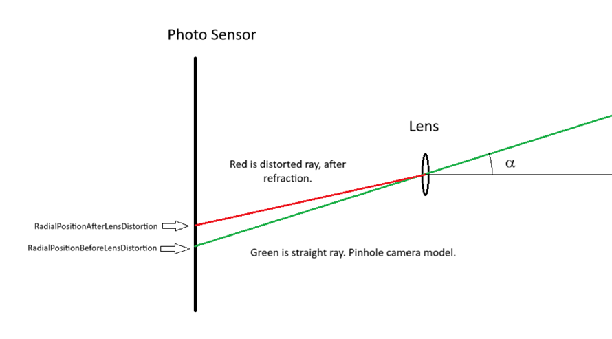

Here is an example on how to create a pair of values mapping *RadialPositionAfterLensDistortion* to *RadialPositionBeforeLensDistortion* using optical characteristic of the lens. 

Profesionnals working with camera lens usually provide mapping from angle α to position on sensor *RadialPositionAfterLensDistortion*. Usually, this information is provided by camera/lens design software such as Zemax OpticStudio. 

In this example, we presume the software outputs two columns: one is angle of the ray (α), and the other is the position on an axis where the way would meet sensor (*RadialPositionAfterLensDistortion*), in millimeters.

| Offset of ray on sensor (*RadialPositionAfterLensDistortion*) in millimeters | Angle α in degrees |
| -- | -- |
| 0.022997392 | 0.902308601 |
| 0.045979278 | 1.804008861 |
| 0.068930936 | 2.704523059 |
| …	| … |
|1.033159104 | 40.53626426 |

Let’s presume that this table is generated for a particular lens with focal length 

$F = 1.460mm$

We assume then that the lens is mounted at distance of F from the sensor. From a camera geometry then we can write:

$RadialPositionBefoerLensDistortion = F × \tan{(α)}$

Using this formula, we can add third column *RadialPosition**Before**LensDistortion*:

| Offset of ray on sensor (*RadialPositionAfterLensDistortion*) in millimeters | Angle α in degrees | *RadialPositionBeforeLensDistortion*  (F × tan(α)) in mm |
| -- | -- | -- |
| 0.022997392 | 0.902308601 | 0.02299436 |
| 0.045979278 | 1.804008861 | 0.0459846 |
| 0.068930936 | 2.704523059 | 0.068967
| …	| … | … |
| 1.219 | 40.53626426 | 1.248557 |

Now that we have both *RadialPositionAfterLensDistortion* and *RadialPositionBeforeLensDistortion* values in mm, we can convert them into pixel metric values. For this particular camera the sensor pixel size was 1.55 micron (0.00155 mm). We need to divide all distances in mm by the sensor pixel size:

$RadialPositionAfterLensDistortionInPixels = RadialPositionAfterLensDistortion / 0.00155mm * 1pixel$

| RadialPositionAfterLensDistortion in pixels | RadialPositionBeforeLensDistortion (F × tan(α)) in pixels |
| -- | -- |
| 14.835 | 14.835 |
| 29.664 | 29.66748 |
| 44.47157 | 44.4948 |
| … | … |
| 786.4516 | 805.52064 |

As we see from the table there is practically no distortion in the center, but it increases towards the edges of the frame. We need the values in the table to cover up to the corner of the frame, which means last entry for *RadialPositionAfterLensDistortion* should be at least half of the sensor diagonal. Therefore, the maximum distance from the optical center that needs to be populated as a value of *RadialPositionAfterLensDistortion*:

$MaximumDistance = \frac{\sqrt{(SensorWidthInPixels^2+ SensorHeightInPixels^2)}}{2}$

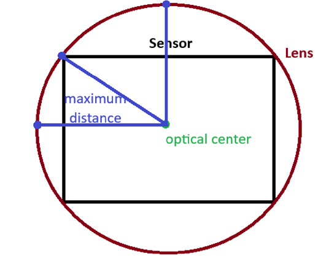

 
This table allows *WSE* to generate a mapping of the offset between *RadialPositionAfterLensDistortion* from center to *RadialPositionBeforeLensDistortion* for the whole frame and therefore correct lens distortion in real time.

### DEVPKEY_WindowsStudio_LensDistortionModel_6k
Alternatively, the driver can provide the ‘6k’ coefficients that describe the lens distortion profile from which we can generate a map.
These coefficients are used in the standard lens correction formula:

$x_{dist} = x\frac{(1+k_1 r^2+k_2 r^4+k_3 r^6)}{(1+k_4 r^2+k_5 r^4+k_6 r^6 )}$

$y_{dist} = y\frac{(1+k_1 r^2+k_2 r^4+k_3 r^6)}{(1+k_4 r^2+k_5 r^4+k_6 r^6 )}$

Where $r=\sqrt{(x^2+y^2)}$

The $x_{dist}$ and $y_{dist}$  are positions after lens distortion, $x$ and $y$ are desired position on the rectilinear image. During lens correction processing, we take the pixel data at position ($x_{dist},y_{dist}$) and move it to position ($x,y$). In order to create a corrected image, we iterate over ($x,y$), look for data pixel at position ($x_{dist},y_{dist}$) and place it at ($x,y$).

To obtain coefficients $k_1,k_2,k_3,k_4,k_5,k_6$, OpenCV has a convenient function called calibrateCameraRO(). This function takes a set of points before and after lens distortion (usually a perfect grid). The coefficients $k_1$ to $k_6$ have dimensionality: their value depends on the unit of measure. We measure all coordinates in terms of pixels which is relative to the size of a pixel on the sensor. Position of ($x,y$) and ($x_{dist},y_{dist}$) are measured in sensor pixels (same as image pixels if no down/up scaling is applied). Therefore all coordinates of points provided to calibrateCameraRO() should be in coordinates of pixels on the sensor. Then the function will output coefficient values for $k_1,k_2,k_3,k_4,k_5,k_6$ in a coherent metric to the rest of the device property parameters.

If the characteristics of the lens are not known, Microsoft will provide a tool that calculates lens distortion profile from images of rectangular chart with grid dots. The image of the chart would look like the below which is a real image captured with a wide field of view lens from which we can then either calculate the $k_1,k_2,k_3,k_4,k_5,k_6$ lens distortion coefficients or generate a map of *RadialPositionBeforeLensDistortion*  and *RadialPositionAfterLensDistortion* when paired with the pinhole intrinsics values from DEVPKEY_WindowsStudio_PinholeIntrinsics. The lens distortion model values can then be shared back with the partner device manufacturer for populating accordingly the device property key in their driver.

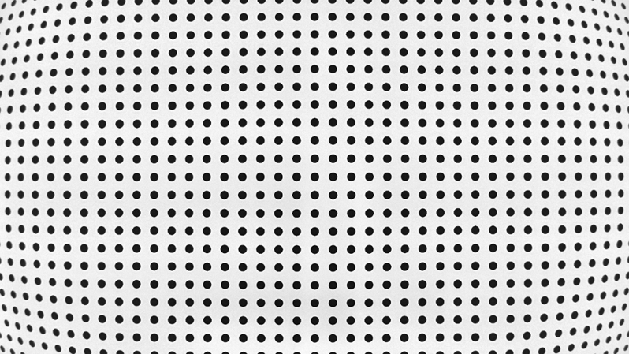

#### C++ definition:

~~~cpp
// define locally GUID for Windows Studio DEVPROPKEY
DEFINE_DEVPROPKEY(DEVPKEY_WindowsStudio_PinholeIntrinsics,
0x0a6244af,, 0xd455, 0x4a0f, 0xb4, 0x3e, 0xf2, 0x95, 0x07, 0xa7, 0xde, 0xb6, 2); /* DEVPROP_TYPE_STRING_LIST */

DEFINE_DEVPROPKEY(DEVPKEY_WindowsStudio_LensDistortionModel_6k,
0x0a6244af,, 0xd455, 0x4a0f, 0xb4, 0x3e, 0xf2, 0x95, 0x07, 0xa7, 0xde, 0xb6, 3); /* DEVPROP_TYPE_STRING_LIST */

DEFINE_DEVPROPKEY(DEVPKEY_WindowsStudio_LensDistortionModel_PolyLinear,
0x0a6244af,, 0xd455, 0x4a0f, 0xb4, 0x3e, 0xf2, 0x95, 0x07, 0xa7, 0xde, 0xb6, 4); /* DEVPROP_TYPE_STRING_LIST */

~~~

#### .inf excerpt to define the above property:
~~~
[Camera.AddProperty]
; Set property to define DEVPKEY_WindowsStudio_PinholeIntrinsics, specifying sensor size in pixels of 3840x2160 as well as focal length in pixels of 1618.

{0A6244AF-D455-4A0F-B43E-F29507A7DEB6}, 2, 18,, “3840.0,2160.0,1618.0”

; Set property to define DEVPKEY_WindowsStudio_LensDistortionModel_6k, specifying the 6 ‘k’ radial distortion coefficients.
; Note that you need to either provide this property or the DEVPKEY_WindowsStudio_LensDistortionModel_PolyLinear. If both are defined, the DEVPKEY_WindowsStudio_LensDistortionModel_PolyLinear takes precedence over DEVPKEY_WindowsStudio_LensDistortionModel_6k.

{0A6244AF-D455-4A0F-B43E-F29507A7DEB6}, 3, 18,, ”0.234567,0.142537,0.112233,0.050607,0.045678,0.019876”

; Set property to define DEVPKEY_WindowsStudio_LensDistortionModel_PolyLinear, specifying 9 pairs of sensor position after lens distortion and before lens distortion. (There can be up to 200 pairs defined)

{0A6244AF-D455-4A0F-B43E-F29507A7DEB6}, 4, 18,, “46.0,45.9846,69.0,68.967,92.0,91.94,115.0,114.9,138.0,137.858,1219.0,1248.557,1679.0,1749.0,2162.0,2543.8,2231.0,2714.0”

~~~

----------
